Spring Boot

## 内容概述


##  Spring Boot简介

Spring Boot —— 零XML配置的Spring框架，从这句话可以看到：（1）Spring Boot可以简化配置。（2）Spring Boot并不属于一个新的技术，其实就是对Spring做了更深一步的封装，代替Spring、让Spring框架用起来更简单。所以你应该清楚，如果你的简历中写的某个项目所用的技术点是：MyBatis+Spring+SpringMVC+SpringBoot那就露怯了，可以写为：MyBatis+Spring+SpringMVC或者MyBatis+SpringBoot。

###  原有Spring/SpringMVC缺点

列举一下典型的问题：

1. Spring/SpringMVC的使用功能强大，但是配置文件中的内容太多 （applicationContext.xml和springmvc.xml中配置太多了），容易造成配置的遗漏。整合SSM的时候还要在web.xml中加入了springmvc.xml、applicationContext.xml的解析，不解析那么配置的xml就不生效了。
2. 项目的依赖管理也是一件耗时耗力的事情。在环境搭建时，需要分析要导入哪些库的坐标，导入坐标的时候还要分析好对应的版本，因为如果版本选错随之而来的不兼容问题就会严重阻碍项目的开发进度。
3.  插件问题，比如：SpringMVC的运行要依赖tomcat，SpringMVC的版本高tomcat7版本低就不能用，就需要将tomcat换为8版本，但是8版本的tomcat也不是官方提供的，是私人服务器提供的，运行起来可能出现问题。
4. ....等等。

于是基于以上问题，就出现了Spring Boot框架，让Spring的使用更加简单并解决现有问题。Spring Boot框架地位逐渐上升，目前已经超过了Spring，可以看一下官网排序：（https://spring.io/projects）

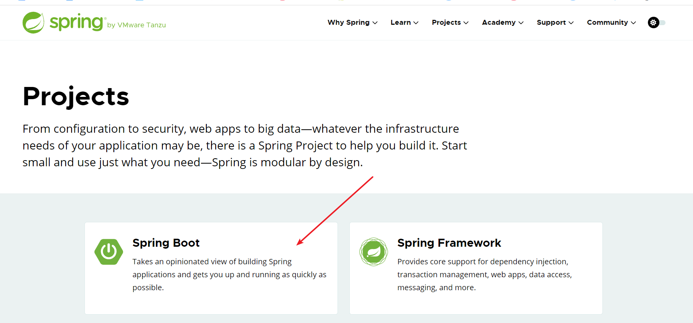


### 概念简介

​		Spring Boot是Spring公司的一个顶级项目，和Spring Framework是一个级别的。

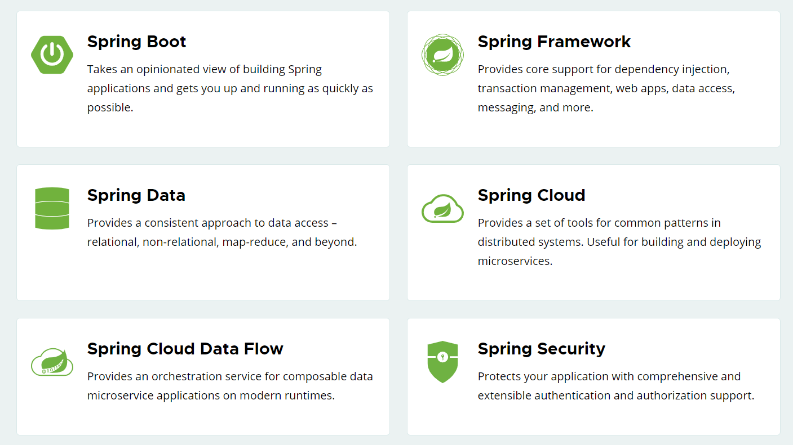

​		Spring Boot实际上是利用Spring Framework 4 自动配置特性完成。编写项目时不需要编写xml文件。发展到现在，Spring Boot已经具有很很大的生态圈，各种主流技术已经都提供了**Spring Boot的启动器**。

​		那什么是Spring Boot的启动器？

​		Spring Boot的启动器实际上就是一个依赖。这个依赖中包含了整个这个技术的相关jar包，以前的坐标依赖我们需要一个一个的导入，而启动器相当于对多个相关的依赖做了整合封装，整合封装后变成了启动器，所以启动器的本质还是依赖，以前需要导入多个依赖现在导入一个启动器即可。使用启动器以后，各版本都内置好了，你也不需要去考虑更换，确保了版本的统一。

​		启动器还包含了这个技术的自动配置，以前绝大多数XML配置都不需要配置了，当然了，启动器中自动配置无法实现所有内容的自动配置，在使用Spring Boot时还需要进行少量的配置（比如数据源信息），但是这个配置不是在xml中了，而是在properties或yml中。

​		启动器的命名规则：如果是Spring官方自己封装的启动器的artifact id名字满足：<span style="color:red">spring-boot-starter-xxxx</span>，如果是第三方公司提供的启动满足：<span style="color:red">xxxx-spring-boot-starter</span>。以后每次使用Spring Boot整合其他技术时首先需要考虑导入启动器。

### Spring Boot特征

1. 使用Spring Boot可以创建独立的Spring应用程序
2. 在Spring Boot中直接嵌入了Tomcat、Jetty、Undertow等Web  容器，内置tomcat为9版本
3. 使用SpringBoot做Web开发时不需要部署WAR文件（以前创建项目想要放在服务器要创建war项目，只有war项目才可以打成war包，才能放到服务器，而现在内置tomcat了你创建jar项目、war项目都无所谓，因为内置tomcat了可以直接运行，不需要扔到别的服务器了。当然了如果你还是需要扔到别的服务器，那还是需要war项目的，以前我们无论用本地tomcat还是插件都不属于内置tomcat。我们学习阶段创建jar项目即可。）
4. 通过提供自己的启动器(Starter)依赖，简化项目构建配置
5. 尽量的自动配置Spring和第三方库
6. 绝对没有代码生成，也不需要XML配置文件

### Spring Boot版本介绍

1. SNAPSHOT：快照版，即开发版，正在开发中，我们工作中一定不能用SNAPSHOT版本。
2. CURRENT：最新版，但是不一定是稳定版。
3. GA：General Availability，正式发布的版本。我们工作中一定选GA版本的。
4. PRE：里程碑版，有重要内容标记的版本。

### API查看

主要看属性文件：

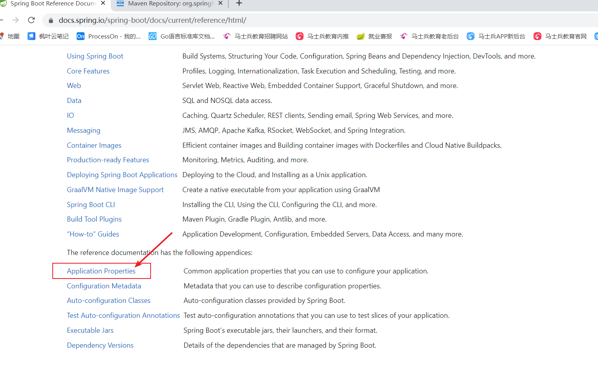

或者直接进入：https://docs.spring.io/spring-boot/docs/current/reference/html/application-properties.html#appendix.application-properties

### Spring Boot的核心

​		**起步依赖**- 即启动器，起步依赖本质上是一个Maven项目对象模型（Project Object Model，POM），定义了对其他库的传递依赖，这些东西加在一起即支持某项功能。 简单的说，起步依赖就是将具备某种功能的坐标打包到一起，并提供一些默认的功能。

​		**自动配置** -Spring Boot的自动配置是一个运行时（更准确地说，是应用程序启动时）的过程，考虑了众多因素，才决定 Spring配置应该用哪个，不该用哪个。该过程是Spring自动完成的。  


## Spring Boot入门项目

需求：Spring Boot入门项目，搭建一个基于Spring Boot的Spring MVC项目，实现访问控制层，浏览器响应一句话：“hello springboot”即可。

如果没有SpringBoot怎么做？

（1）搭建项目，引入spring、springmvc的一堆坐标

（2）加入controller层，加入方法，加入注解

（3）编写springmvc.xml配置文件

（4）在web.xml中解析springmvc.xml

（5）加入tomcat插件

（6）启动服务器，运行并访问

那么用SpringBoot怎么做呢？

（1）搭建项目

（2）导入SpringBoot起步依赖

（3）加入controller层，加入方法，加入注解

（4）先写启动类

（5）启动测试

### 创建项目

创建最外层空项目，将SpringBoot所有练习代码放入这个空项目中：


在空项目下创建SpringBoot的第一个项目（Module）:


###  导入SpringBoot起步依赖

【1】在pom.xml中添加该SpringBoot项目需要继承的父工程：（主要目的：1. 配置文件 2. 插件 3.依赖jar），

~~~xml
<parent>
    <groupId>org.springframework.boot</groupId>
    <artifactId>spring-boot-starter-parent</artifactId>
    <version>3.0.6</version>
</parent>
~~~

继承父工程的作用是什么呢？可以点进spring-boot-starter-parent看一下源码，进入后发现它又依赖父工程，点击spring-boot-dependencies进入父工程，可以看到依赖的springboot的坐标是：（下面代码块摘自源码）

```xml
<artifactId>spring-boot-dependencies</artifactId>
<version>3.0.6</version>
```

往下看还有<properties>标签，内部可以看到很多技术对应的版本信息，这些技术的版本信息已经内置规定好了，这些版本信息都是精挑细选的，如果将来某一天你用到这些技术，这些版本之间是一定不会造成冲突的，相当于springboot在定义3.0.6版本的时候把其他大部分技术对应的版本都定义好了，都是经过测试的，我们使用的时候放心大胆的去用就行了，如果人家没有给我们规定好，让我们自己去选择版本的话，很可能就造成冲突了。

往下看还有<dependencyManagement>标签，叫做版本锁定，一般在父工程中定义一些版本的信息，这样子工程继承父工程的时候，就无需指定版本信息了，比如后续我们在项目中要是引入spring-boot-starter-web就无需指定版本信息了，因为已经内置好了：（下面代码块摘自源码）

```xml
<dependency>
  <groupId>org.springframework.boot</groupId>
  <artifactId>spring-boot-starter-web</artifactId>
  <version>3.0.6</version>
</dependency>
```

【2】引入spring启动器——web开发的起步依赖：

```xml
<dependencies>
    <dependency>
        <groupId>org.springframework.boot</groupId>
        <artifactId>spring-boot-starter-web</artifactId>
    </dependency>
</dependencies>
```

也可以点入spring-boot-starter-web的源码看，发现里面其实是封装了很多依赖信息的，具体可以查看<dependencies>标签内部。也可以在idea右侧查看：


注意：上面的方式我们引入的是父工程，但是在公司中可能会出现必须继承某个项目，如果Spring Boot用了继承就不能继承别的项目了。所以Spring Boot还提供了直接依赖的方式。

~~~xml
<dependencyManagement>
    <dependencies>
        <dependency>
            <groupId>org.springframework.boot</groupId>
            <artifactId>spring-boot-dependencies</artifactId>
            <version>3.0.6</version>
            <type>pom</type>
            <scope>import</scope>
        </dependency>
    </dependencies>
</dependencyManagement> 
~~~

### 新建控制器

​		在com.msb.controller包下新建DemoController。（PS：<font color='red'>保证这个类在启动类子包中或同级包中</font>）

```java
package com.msb.controller;

import org.springframework.stereotype.Controller;
import org.springframework.web.bind.annotation.RequestMapping;
import org.springframework.web.bind.annotation.ResponseBody;

/**
 * @Author: zhaoss
 *
 * @Controller 容器创建DemoContrller对象
 * @RequestMapping("/show")  访问该方法的路径
 */
@Controller
public class DemoController {
    @RequestMapping("/show")
    @ResponseBody
    public String show(){
        return "hello springboot"; // 响应给浏览器一句话
    }
}

```

要是以前还要创建springmvc.xml，对上面的注解扫描，还需要在web.xml中解析springmvc.xml,但是现在不需要了，怎么办呢？创建一个启动类。

### 新建启动类

​		Spring Boot的启动类的作用是启动Spring Boot项目，是基于Main方法来运行的。

​		注意：启动类在启动时会**做注解扫描**(@Controller、@Service、@Repository......)，扫描位置为同包或者子包下的注解，所以启动类的位置应放于包的根下。

​		启动类表示项目的启动入口（与之前说的启动器不同，启动器表示jar包的坐标）

​		必须在包中新建这个类，不能直接放入到java文件夹。在com.msb下新建自定义名称的类。命名常用规范：XXXXApplication。

~~~java
package com.msb;

import org.springframework.boot.SpringApplication;
import org.springframework.boot.autoconfigure.SpringBootApplication;

/**
 * @Author: zhaoss
 * @SpringBootApplication 加入该注解，代表该类是启动类
 * 启动类的作用：
 * 可以启动SpringBoot项目
 * 可以扫描同包或者子包中的注解，所以一般
 */
@SpringBootApplication
public class MyApplication {
    // 启动类是基于Main方法来运行的
    public static void main(String[] args) {
        // 以MyApplication.class为参照，扫描该类同包或者子包中的注解
        SpringApplication.run(MyApplication.class,args);
    }
}

~~~

### 启动项目

​	运行主方法。

   不用启动tomcat了，因为已经内置tomcat了，直接运行即可。默认tomcat端口为<font color='red'>8080</font>端口。

​	上下文路径默认是“/”


浏览器访问：http://localhost:8080/show

结果：


##  使用IDEA快速创建SpringBoot项目

通过SpringBoot的入门项目发现，每次创建SpringBoot项目，都要导入父项目，都要定义启动类，那么就干脆提供一种快速创建SpringBoot项目的方式：使用模板方式创建。

​     1.  选择模板快速创建，输入对应的项目名称和启动类所在包位置


2. 选择SpringBoot的版本和导入的启动器


​     3 . 对应的配置信息可以删除


后续按照需求补充自己的代码即可。

注意启动项目的时候，tomcat是否在其它Module中已经启动了，如果重复启动肯定会报端口冲突的错误。

##  Spring Boot配置文件           

​	上述SpringBoot的案例中发现没有配置文件，但是总有一些情况不满足你的需求，比如：默认端口号8080，可以修改吗?可以，需要额外添加配置文件。

​	这个配置文件有严格的要求，名字比如为application的全局配置文件，支持三种格式properteis格式、YML格式（yml或yaml格式）。

​	比如在利用模板快速构建SpringBoot项目的时候，resources目录就就默认帮我们创建了application.properteis的配置文件。


### Properties格式

​	对SpringBoot进行配置，案例：	配置Tomcat监听端口，配置项目的上下文：

~~~properties
server.port=8888   #配置Tomcat监听端口
server.servlet.context-path=/hello   #配置项目的上下文
~~~

​	启动类启动，运行： 


   属性文件中key的内容不可以随便写，参照API：

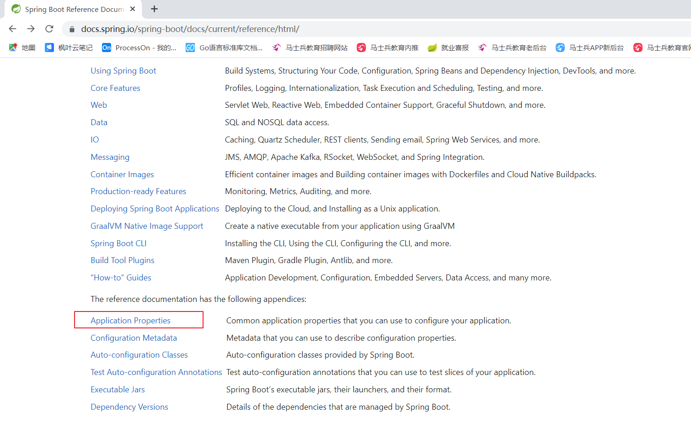

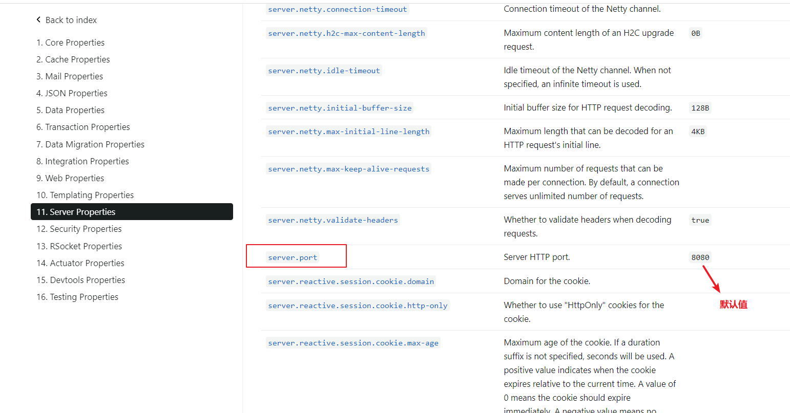

### YML格式

YML格式配置文件的扩展名可以是<span style="color:red;">yaml或者yml</span>，没有区别，用哪个都可以。

官方推荐的配置方式是：YML格式配置。

#### 基本格式要求

1. 大小写敏感
2. 使用缩进代表层级关系
3. 相同的部分只出现一次，更加简洁
4. 注意一定要有空格

#### 书写格式

普通数据类型：

~~~yaml
server:
  port: 8888
  servlet:
    context-path: /hello
~~~


 

###  配置文件加载

#### 不同格式的加载顺序

​	如果同一个目录下，有application.yml也有application.properties，默认先读取application.properties，再读取application.yml。

​    相同属性，优先走application.properties的，属性不同的合并生效。

比如：在application.properties配置：


在application.yml中配置：


运行程序结果：


​	

#### 不同位置的加载顺序

配置文件不仅可以直接放在resources目录下，它可以放在很多位置：

1. 当前项目根目录中
2. 当前项目根目录下的一个/config子目录中
3. 项目的resources即classpath类路径中
4. 项目的resources即classpath类路径下的/config目录中


如果不同的目录下都存在配置文件，那么同一个属性的加载顺序是：

（排序就是依次加载顺序）

1. <span style="color:red;">config/application.properties</span>

2. <span style="color:red;">config/application.yml</span>
3. <span style="color:blue;">application.properties</span>
4. <span style="color:blue;">application.yml</span>
5. <span style="color:red;">resources/config/application.properties</span>
6. <span style="color:red;">resources/config/application.yml</span>
7. <span style="color:blue;">resources/application.properties</span>
8. <span style="color:blue;">resources/application.yml</span>

（可以自行创建项目去试试，如果在Module中不生效，我讲课构建的是Module）


### 切换环境

比如在实际的开发中会有生产环境，开发环境，测试环境等，需要用到的配置文件肯定不同，此时就需要进行环境的切换。怎么做呢？利用全局Profile配置。

Profile 是Spring 用来针对不同环境对不同配置提供支持的全局Profile配置使用application-{profile}.yml，比如application-dev.yml ,application-test.yml。

通过在application.yml中设置spring.profiles.active=test|dev|prod 来动态切换不同环境,具体配置如下:

application-dev.yml 开发环境配置文件：

```
server:
	port: 8989
```

application-test.yml 测试环境配置文件：

```
server:
	port: 9999
```

application-prod.yml 生产环境配置文件：

```
server:
	port: 8686
```

application.yml 主配置文件：

```
## 环境选择配置
spring:
	profiles:
		active: dev
```


启动Starter 查看控制台输入效果：


##  Spring Boot项目目录结构

在此我们重点来说resources目录


Spring Boot项目-resources目录用来放置配置文件，之前我们已经放过.yml和.properties的文件。

**--config**  可以自己创建加入到resources目录中，不是默认自带的，可以存在配置文件的，但是我们一般直接放到resources下。

**--templates** 放置视图，如：thymeleaf/FreeMarker页面所在目录。

**--static**   静态资源。放入图片、js、css、以及你想要放行的html文件都可以，不会被服务器解析。

​				之前在SpringMVC中，我们在访问的时候都对静态文件进行放行了，在SpringBoot架构中无处配置，专门提供一个目录static，将文件放入这个目录，和我们之前SpringMVC中配置静态资源放行是一个道理，放入static的文件不会被解析会直接被访问到。


**案例：**创建一个SpringBoot项目，在static目录下新创建images目录，创建好的目录结构为：


static.images目录的关系类似于java目录下的com.msb.test等，如果想要打开，选择：


搞一个图片放入images目录下

启动项目，访问：http://localhost:8080/images/demo.png，即可在浏览器中看到想要访问的图片。

​	<font color='red'>**注意** </font>:

​	static该目录是SpringBoot可以直接识别的目录，会将其中的静态资源编译到web项目中，并放到tomcat中使用。静态资源的访问路径中无需声明static。

​	IDEA中经常出现放在static下的静态文件即使重启也不被编译。需要通过Maven面板进行清空缓存，重新编译启动即可识别。


在哪可以看出static目录是默认静态资源的指定位置呢？


其中classpath指的就是target目录下的classes:


##  Spring Boot整合MyBatis

### 方式一：mapper层用注解配置


Spring Boot里面就含有Spring和SpringMVC了，所以Spring Boot整合MyBatis就相当于之前的SSM。

####  依赖启动器


（1）引入spring启动器——web开发的起步依赖，录入web即可

（2）引入Mybatis启动器——用于整合Mybatis，录入mybatis即可

（3）引入mysql 驱动，录入mysql即可

（4）简化 JavaBean 的编写：setter、getter方法简化——引入lombok，录入lombok即可

咱都不用选版本，它会自动选择匹配的版本，非常方便。


~~~xml
<dependencies>

        <!--Spring启动器-->
        <dependency>
            <groupId>org.springframework.boot</groupId>
            <artifactId>spring-boot-starter-web</artifactId>
        </dependency>

        <!--Mybatis启动器,Mybatis为了整合SpringBoot第三方提供的-->
        <dependency>
            <groupId>org.mybatis.spring.boot</groupId>
            <artifactId>mybatis-spring-boot-starter</artifactId>
            <version>3.0.2</version>
        </dependency>

        <!--MySQL依赖-->
        <dependency>
            <groupId>com.mysql</groupId>
            <artifactId>mysql-connector-j</artifactId>
            <scope>runtime</scope>
        </dependency>
        <!--lombok依赖-->
        <dependency>
            <groupId>org.projectlombok</groupId>
            <artifactId>lombok</artifactId>
            <optional>true</optional>
        </dependency>

        <dependency>
            <groupId>org.springframework.boot</groupId>
            <artifactId>spring-boot-starter-test</artifactId>
            <scope>test</scope>
        </dependency>
        <dependency>
            <groupId>org.mybatis.spring.boot</groupId>
            <artifactId>mybatis-spring-boot-starter-test</artifactId>
            <version>3.0.2</version>
            <scope>test</scope>
        </dependency>
    </dependencies>
~~~

#### 配置Lombok注解生效

注意要让lombok的注解生效需要勾选：

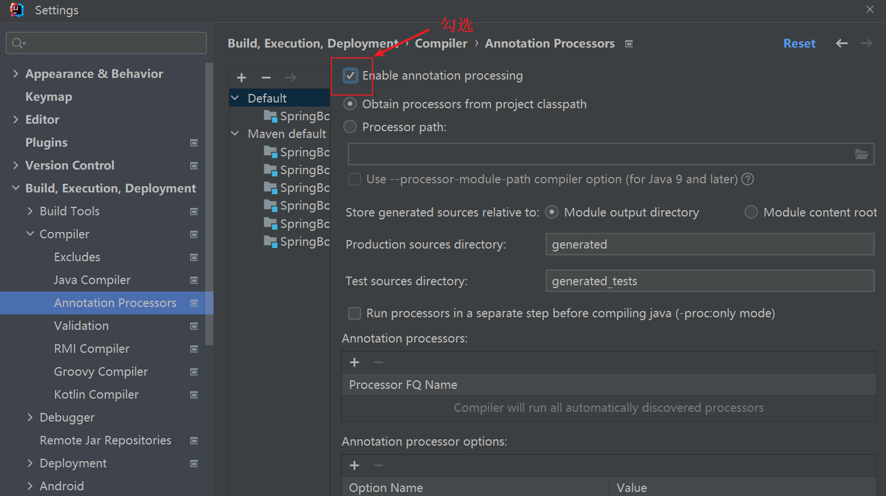

#### 创建表

在数据库中随便找一个表，或者创建一个新表：


####  配置配置文件

​	连数据库，肯定要进行配置，在application.yml中添加（将默认自带的application.properties冲命名为：application.yml，这是官方推荐的）

~~~yaml
# 数据源（数据库连接池） 配置
spring:
  datasource:
  	driver-class-name: com.mysql.cj.jdbc.Driver
    url: jdbc:mysql://127.0.0.1:3306/msbsys?characterEncoding=utf8&useSSL=false&serverTimezone=Asia/Shanghai
    username: root
    password: root
~~~

​	

#### 构建实体类

在java目录下构建：com.msb.pojo包，构建User类：

```java
package com.msb.pojo;

import lombok.AllArgsConstructor;
import lombok.Data;
import lombok.NoArgsConstructor;

/**
 * @Author: zhaoss
 */
@NoArgsConstructor
@AllArgsConstructor
@Data
public class User {
    private int uid;
    private String uname;
    private String pwd;
    private String realname;
    private int identity;
}

```


PS：lombok常用注解：

```xml
@Getter/@Setter: 作用类上，生成所有成员变量的getter/setter方法；
	作用于成员变量上，生成该成员变量的getter/setter方法。

@ToString: 作用于类，覆盖默认的toString()方法

@EqualsAndHashCode: 作用于类，覆盖默认的equals和hashCode

@NoArgsConstructor：生成无参构造器；

@RequiredArgsConstructor：生成包含final和@NonNull注解的成员变量的构造器；

@AllArgsConstructor：生成全参构造器

@Data: 作用于类上，注解集合，使用它相当于使用下列注解：
	@ToString 
	@EqualsAndHashCode 
	@Getter 
	@Setter 
	@RequiredArgsConstructor

@Builder: 作用于类上，将类转变为建造者模式

@Log: 作用于类上，生成日志变量

```

#### 创建接口，加入注解：

构建com.msb.mapper包，创建接口：UserMapper

```java
package com.msb.mapper;

import com.msb.pojo.User;
import org.apache.ibatis.annotations.Select;

import java.util.List;

/**
 * @Author: zhaoss
 */
public interface UserMapper {
    /*查询*/
    @Select("select * from t_user")
    List<User> selectAllUsers();
}
```


#### 创建Service层

在com.msb.service中定义接口层：

```java
package com.msb.service;

import com.msb.pojo.User;

import java.util.List;

/**
 * @Author: zhaoss
 */
public interface UserService {
    List<User> findAllUsers();
}

```

在com.msb.service.impl中构建UserServiceImpl类：

```java
package com.msb.service.impl;

import com.msb.mapper.UserMapper;
import com.msb.pojo.User;
import com.msb.service.UserService;
import org.springframework.beans.factory.annotation.Autowired;
import org.springframework.stereotype.Service;

import java.util.List;

/**
 * @Author: zhaoss
 */
// 加入注解，构建UserServiceImpl对象
@Service
public class UserServiceImpl implements UserService {

    // 注入Mapper对象：
    @Autowired
    private UserMapper userMapper;
    @Override
    public List<User> findAllUsers() {
        return userMapper.selectAllUsers();
    }
}

```

#### 添加注解

但是，上面的userMapper对象还不存在，无法自动注入，以前我们是需要扫描的才可以构建对象的，现在也是，怎么扫描呢？

在启动类中加入MapperScan注解：扫描整个mapper包才会产生具体的mapper对象


```java
package com.msb;
import org.mybatis.spring.annotation.MapperScan;
import org.springframework.boot.SpringApplication;
import org.springframework.boot.autoconfigure.SpringBootApplication;
@SpringBootApplication
@MapperScan("com.msb.mapper")  // 在启动类上添加注解，表示mapper接口所在位置
public class SpringBootM3Application {
    public static void main(String[] args) {
        SpringApplication.run(SpringBootM3Application.class, args);
    }
}
```


当然也可以在UserMapper接口上加入@Mapper注解，但是这样只会扫描一个接口，我们还是用的上面的方式，扫描整个包。

```java
package com.msb.mapper;

import com.msb.pojo.User;
import org.apache.ibatis.annotations.Mapper;
import org.apache.ibatis.annotations.Select;

import java.util.List;

/**
 * @Author: zhaoss
 */
@Mapper
public interface UserMapper {
    /*查询*/
    @Select("select * from t_user")
    List<User> selectAllUsers();
}
```


#### 创建Controller层

```java
package com.msb.controller;

import com.msb.pojo.User;
import com.msb.service.UserService;
import org.springframework.beans.factory.annotation.Autowired;
import org.springframework.stereotype.Controller;
import org.springframework.web.bind.annotation.RequestMapping;
import org.springframework.web.bind.annotation.ResponseBody;

import java.util.List;


/**
 * @Author: zhaoss
 *
 * @Controller 容器创建DemoContrller对象
 * @RequestMapping("/show")  访问该方法的路径
 * @ResponseBody 将controller的方法返回的对象转换为指定的格式(JSON数据或者是XML)
 */
@Controller
public class UserController {
    // 注入servicec层对象：
    @Autowired
    private UserService userService;
    @RequestMapping("/findAll")
    @ResponseBody
    public List<User> findAll(){
        return userService.findAllUsers();
    }
}
```

启动类启动，并访问：http://localhost:8080/findAll

结果：


PS：可以自行去对比一下以前SSM的整合配置文件部分有多麻烦，自动配置已经帮我们搞定了！


### 方式二：mapper层用配置文件配置

方式一中，mapper层利用的是注解方式，那么不用注解的话也可以使用配置文件，步骤与7.1.1-7.1.5一致

#### 创建接口：

构建com.msb.mapper包，创建接口：UserMapper

```java
package com.msb.mapper;

import com.msb.pojo.User;
import org.apache.ibatis.annotations.Select;

import java.util.List;

/**
 * @Author: zhaoss
 */
public interface UserMapper {
    /*查询*/
    List<User> selectAllUsers();
}
```

不用注解，那么就需要写mapper.xml配置文件，在com.msb.mapper下创建UserMapper.xml文件：

```xml
<?xml version="1.0" encoding="UTF-8" ?>
<!DOCTYPE mapper
        PUBLIC "-//mybatis.org//DTD Mapper 3.0//EN"
        "https://mybatis.org/dtd/mybatis-3-mapper.dtd">
<mapper namespace="com.msb.mapper.UserMapper">
    <select id="selectAllUsers" resultType="com.msb.pojo.User">
        select * from t_user
    </select>
</mapper>
```


#### 添加资源拷贝插件

将UserMapper.xml文件放置在com.msb.mapper下，不会被解析，需要在pom.xml-中添加资源拷贝插件：

```xml
<build>
    <resources>
        <resource>
            <directory>src/main/java</directory>
            <includes>
                <include>**/*.xml</include>
            </includes>
            <filtering>true</filtering>
        </resource>
        <resource>
            <directory>src/main/resources</directory>
            <filtering>true</filtering>
        </resource>
    </resources>
</build>
```

加入资源拷贝插件后别忘了刷新pom.xml配置。


搞定以后，启动项目，重新访问：


#### 配置文件放入resources目录

上面的方式中，我们吧UserMapper.xml放入com.msb.mapper目录下，在SpringBoot中非常不推荐这样的方式，配置方式建议放在resources目录下


以前放在一起的时候，扫描是先扫mapper接口，再找同包下接口对应的同名的xml，现在分开了。

分开后要单独对xml进行扫描，否则找不到，在application.yml中加入mapper.xml的扫描：

```xml
mybatis:
  mapper-locations: classpath:mapper/*.xml
```

既然分开了，xml的名字也不用非要叫UserMapper了，随意。内部通过namespace关联，外面名字无需非要一样。

注意：启动类中：

```java
package com.msb;

import org.mybatis.spring.annotation.MapperScan;
import org.springframework.boot.SpringApplication;
import org.springframework.boot.autoconfigure.SpringBootApplication;
import org.springframework.boot.web.servlet.ServletComponentScan;

@SpringBootApplication
@MapperScan("com.msb.mapper")  // 扫描mapper层，上面定义的是去哪里扫描mapper.xml
public class SpringBootMybatisDemo01Application {

    public static void main(String[] args) {
        SpringApplication.run(SpringBootMybatisDemo01Application.class, args);
    }

}

```


#### 设置实体类包别名

~~~yaml
mybatis:
  type-aliases-package: com.msb.pojo   #给指定包中的所有类起别名
~~~

resultType中改为别名即可：

```xml
<?xml version="1.0" encoding="UTF-8" ?>
<!DOCTYPE mapper
        PUBLIC "-//mybatis.org//DTD Mapper 3.0//EN"
        "https://mybatis.org/dtd/mybatis-3-mapper.dtd">
<mapper namespace="com.msb.mapper.UserMapper">
    <select id="selectAllUsers" resultType="User">
        select * from t_user
    </select>
</mapper>
```


## Spring Boot整合Druid

### 1. 数据库连接池回顾

普通的JDBC数据库连接使用 DriverManager 来获取，每次向数据库建立连接的时候都要将 Connection加载到内存中，再验证用户名和密码(得花费0.05s～1s的时间)。需要数据库连接的时候，就向数据库要求 一个，执行完成后再断开连接。这样的方式将会消耗大量的资源和时间。数据库的连接资源并没有得到很 好的重复利用。若同时有几百人甚至几千人在线，频繁的进行数据库连接操作将占用很多的系统资源，严 重的甚至会造成服务器的崩溃。

对于每一次数据库连接，使用完后都得断开。否则，如果程序出现异常而未能关闭，将会导致数据库系统 中的内存泄漏，最终将导致重启数据库。 

这种开发不能控制被创建的连接对象数，系统资源会被毫无顾及的分配出去，如连接过多，也可能导致内 存泄漏，服务器崩溃。

为解决传统开发中的数据库连接问题，可以采用数据库连接池技术。 数据库连接池的基本思想：就是为数据库连接建立一个“缓冲池”。预先在缓冲池中放入一定数量的连接，当需要 建立数据库连接时，只需从“缓冲池”中取出一个，使用完毕之后再放回去。

数据库连接池负责分配、管理和释放数据库连接，它允许应用程序重复使用一个现有的数据库连接，而不是重 新建立一个。

数据库连接池在初始化时将创建一定数量的数据库连接放到连接池中，这些数据库连接的数量是由最小数据库 连接数来设定的。无论这些数据库连接是否被使用，连接池都将一直保证至少拥有这么多的连接数量。连接池 的最大数据库连接数量限定了这个连接池能占有的最大连接数，当应用程序向连接池请求的连接数超过最大连 接数量时，这些请求将被加入到等待队列中。


### 2. Druid

​	Druid是由阿里巴巴推出的数据库连接池。它结合了C3P0、DBCP、PROXOOL等数据库连接池的优点。之所以从众多数据库连接池中脱颖而出，还有一个重要的原因就是它包含控制台。

### 3. 代码实现

#### 3.1 添加依赖

~~~xml
<!-- 添加druid启动器-->
<dependency>
    <groupId>com.alibaba</groupId>
    <artifactId>druid-spring-boot-starter</artifactId>
    <version>1.2.11</version>
</dependency>
~~~

#### 3.2 编写配置文件

~~~yaml
spring:
  datasource:
    type: com.alibaba.druid.pool.DruidDataSource  #底层使用druid连接池
    driver-class-name: com.mysql.cj.jdbc.Driver
    url: jdbc:mysql://localhost:3306/msbsys?serverTimezone=Asia/Shanghai&useSSL=false&characterEncoding=utf8
    username: root
    password: root
    druid:
      # 连接池的配置信息
      initial-size: 5  # 初始化连接数大小
      max-active: 30  # 最大连接数
      min-idle: 5   # 最小连接数
      
      # 配置获取连接等待超时的时间
      max-wait: 60000  #如果连接都被占用，最大等待时间1min=60000ms
      validation-query: SELECT 1 FROM DUAL  #通过从续表查询来监控是否连接数据库，语句执行能连接，语句不执行没连接
      # 配置一个连接在池中最小空闲的时间，单位是毫秒
      min-evictable-idle-time-millis: 300000
      test-while-idle: true
      # 开启SQL监控、防火墙监控、日志监控
      filters: stat,wall,slf4j
      # 配置DruidStatViewServlet
      stat-view-servlet:
        # 登录名
        login-username: admin
        # 登录密码
        login-password: admin
        url-pattern: /druid/*
        # IP白名单(没有配置或者为空，则允许所有访问)
        allow: 192.167.10.1,127.0.0.1  # 本机和设置的ip可以访问后台管理界面
        reset-enable: false # 不要重置
        # 启用控制台-后台管理界面，必须启用，否则访问界面会404
        enabled: true

mybatis:
   #起别名
  type-aliases-package: com.msb.pojo
   #扫描mybatis下所有的xml文件
  mapper-locations: classpath:mapper/*.xml
~~~

启动不报错就是成功了，是否用连接池从项目看不出来，只能从控制台看，可以通过后台的视图来监测访问的请求，访问：

http://localhost:8080/druid/asdf

很遗憾，监控页面报`404`，主要是因为springboot3.0使用`Jakarta EE 10`，从 Java EE 变更为 Jakarta EE，包名以 javax开头的需要相应地变更为jakarta，如javax.servlet.*，修改为jakarta.servlet.*。目前Druid最新版本1.2.18仍使用javax的旧包，故无法使用，需要等Druid官方升级后方可使用。


（PS：笔记时间为：2023年7月，后续可能就好使了，以实际测试为准）

正常页面：


## Spring Boot的Banner图标

### 什么是Banner

在介绍Banner的定制和关闭操作之前，我们先来了解一下什么是Banner。在搭建Spring Boot项目环境时，SpringBoot应用程序启动的时候，会输出一个默认的醒目的SpringBoot图标，我们称这个图标为Banner，它是一张ascii字符组成的图案，可以设置不同的颜色、字体、大小等属性，用于展示应用程序的信息，例如名称、版本、版权信息等。这是Spring Boot项目与Spring项目启动区别较大的地方，如果你不想展示默认的Banner，也可以关闭Banner展示。


### Banner图标自定义

Spring Boot项目启动时默认加载src/main/resources 目录下的banner.txt 图标文件，如果该目录文件未提供，则使用Spring Boot 默认图标打印。

如果想要替换SpringBoot默认的Banner，可以使用以下方法来定制Banner：

在src/main/resources 目录下新建banner.txt 文本文件，打开网址: http://patorjk.com/software/taag/#p=display&f=Graffiti&t=Type%20Something%20

在线生成图标对应文本并将文本内容copy 到banner.txt 中


重启服务器，运行项目，结果：


### Banner图标关闭

如果你不想展示任何Banner，可以通过以下方式关闭它：

在配置文件application.yml中设置spring.main.banner-mode属性为off

```xml
spring:
  main:
    banner-mode: off
```


## Spring Boot整合logback

目前为止我们没有看到任何日志，我们需要进行日志管理。

Spring Boot默认使用Logback组件作为日志管理（官方推出的）。Logback是由log4j创始人设计的一个开源日志组件。

在Spring Boot项目中我们不需要额外的添加Logback的依赖，因为在spring-boot-starter或者spring-boot-starter-web中已经包含了Logback的依赖。


使用案例：打印sql相关日志。在配置文件application.yml中设置：

```xml
# 不改变日志类型和日志规则 只开启mybatis中对应SQL的日志
logging:
  level:
    com.msb.mapper: trace
```

启动服务器，访问：http://localhost:8080/findAll

结果：

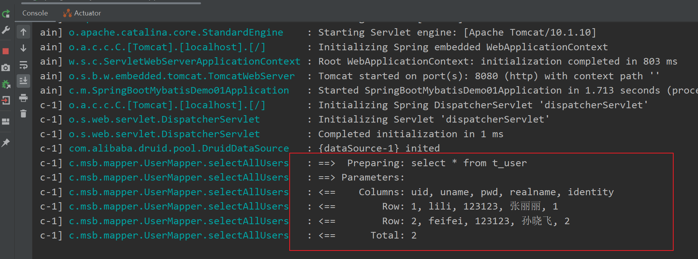


上面的日志只能打印在控制台，如果想要在本地的目录中打印怎么办呢？

在resources目录下创建logback.xml（或logback-test.xml，名字必须这样起）文件：

```xml
<?xml version="1.0" encoding="UTF-8" ?>
<configuration>
    <!--定义日志文件的存储地址 勿在 LogBack 的配置中使用相对路径-->
    <property name="LOG_HOME" value="${catalina.base}/logs/" />
    <!-- 控制台输出 -->
    <appender name="Stdout" class="ch.qos.logback.core.ConsoleAppender">
        <!-- 日志输出编码 -->
        <layout class="ch.qos.logback.classic.PatternLayout">
            <!--格式化输出：%d表示日期，%thread表示线程名，%-5level：级别从左显示5个字符宽度%msg：日志消息，%n是换行符-->
            <pattern>%d{yyyy-MM-dd HH:mm:ss.SSS} [%thread] %-5level %logger{50} - %msg%n
            </pattern>
        </layout>
    </appender>
    <!-- 在文件中输出日志，按照每天生成日志文件 -->
    <appender name="RollingFile"  class="ch.qos.logback.core.rolling.RollingFileAppender">
        <rollingPolicy class="ch.qos.logback.core.rolling.TimeBasedRollingPolicy">
            <!--日志文件输出的文件名-->
            <FileNamePattern>${LOG_HOME}/server.%d{yyyy-MM-dd}.log</FileNamePattern>
            <MaxHistory>30</MaxHistory>
        </rollingPolicy>
        <layout class="ch.qos.logback.classic.PatternLayout">
            <!--格式化输出：%d表示日期，%thread表示线程名，%-5level：级别从左显示5个字符宽度%msg：日志消息，%n是换行符-->
            <pattern>%d{yyyy-MM-dd HH:mm:ss.SSS} [%thread] %-5level %logger{50} - %msg%n
            </pattern>
        </layout>
        <!--日志文件最大的大小-->
        <triggeringPolicy class="ch.qos.logback.core.rolling.SizeBasedTriggeringPolicy">
            <MaxFileSize>10MB</MaxFileSize>
        </triggeringPolicy>
    </appender>

    <!-- 日志输出级别 -->
    <root level="info">
        <appender-ref ref="Stdout" />
        <appender-ref ref="RollingFile" />
    </root>

    <logger name="com.msb.mapper" level="TRACE"></logger>

    <!--日志异步到数据库，将日志存入数据库，用的不多 -->
    <!--     <appender name="DB" class="ch.qos.logback.classic.db.DBAppender">
            日志异步到数据库
            <connectionSource class="ch.qos.logback.core.db.DriverManagerConnectionSource">
               连接池
               <dataSource class="com.mchange.v2.c3p0.ComboPooledDataSource">
                  <driverClass>com.mysql.jdbc.Driver</driverClass>
                  <url>jdbc:mysql://127.0.0.1:3306/databaseName</url>
                  <user>root</user>
                  <password>root</password>
                </dataSource>
            </connectionSource>
      </appender> -->

</configuration>
```


## SpringBoot整合Thymeleaf

我们最早学习的视图显示页面为：html，如果你不需要从作用域或者集合中获取数据的话，用html没问题的，但是我们应用的场所往往是从作用域或者集合中获取数据，这时候就需要使用页面模板技术：JSP、Thymeleaf、FreeMarker。

所谓的页面模板技术，就是：页面 + 占位符 + 动态数据 = 渲染最终的页面。

SpringBoot默认打包方式是jar包，jar包是压缩包，jsp不支持在压缩包内编译，SpringBoot默认是不支持jsp的。那么想要进行页面跳转，就需要使用第三方模板引擎技术实现页面渲染。Thymeleaf是SpringBoot官方推荐的视图显示技术，长的很像html，但作用与jsp一致。SpringBoot项目构建jar项目右键都不能创建jsp。Thymeleaf是用于代替jsp的。Thymeleaf是原生的,不依赖于标签库.它能够在接受原始HTML的地方进行编辑和渲染.因为它没有与Servelet规范耦合,因此Thymeleaf模板能进入jsp所无法涉足的领域。

后台开发人员会比较常用Thymeleaf，所以对后端工程师来说语法比较简单非常贴近于之前使用jsp的方式，上手非常快。但是也有明显的缺点：Thymeleaf不属于高性能的模板引擎，如果想要开发高并发的应用还想要页面跳转，最好进行前后端分离让前端来做，简单的单体应用用Thymeleaf没有问题的。

### 1. Thymeleaf介绍

​	Thymeleaf的主要目标是将优雅的自然模板带到开发工作流程中，并将HTML在浏览器中正确显示，并且可以作为静态原型，让开发团队能更容易地协作。Thymeleaf能够处理HTML，XML，JavaScript，CSS甚至纯文本。长期以来,jsp在视图领域有非常重要的地位,随着时间的变迁,出现了一位新的挑战者:Thymeleaf,Thymeleaf是原生的,不依赖于标签库.它能够在接受原始HTML的地方进行编辑和渲染.因为它没有与Servelet规范耦合,因此Thymeleaf模板能进入jsp所无法涉足的领域。

```text
Thymeleaf在Spring Boot项目中放入到resources/templates中。这个文件夹中的内容是无法通过浏览器URL直接访问的（和WEB-INF效果一样），所有Thymeleaf页面必须先走控制器。
```

​	模板引擎的示意图：(<span style="color:red;">模板+数据模型=输出 </span>)  


### 2. 使用步骤

#### 在pom.xml中添加Thymeleaf启动器

快速构建创建新项目，添加启动器：


~~~xml
<!--thymeleaf启动器-->
<dependency>
    <groupId>org.springframework.boot</groupId>
    <artifactId>spring-boot-starter-thymeleaf</artifactId>
</dependency>
~~~

从启动器名字可以看出，这是官方提供的启动器，证明SpringBoot已经自动配置好了thymeleaf。

如何验证SpringBoot已经自动配置好了thymeleaf，可以点入源码看一下：（在idea中double shift搜索类 ）

```java
public class ThymeleafAutoConfiguration {
	...
    static class DefaultTemplateResolverConfiguration {
    	...
    	// 1.所有thymeleaf的配置值都在ThymeleafProperties中
        private final ThymeleafProperties properties;
        ...  
        // 2.在spring的容器中放入一个模板引擎的解析器
        @Bean
        SpringResourceTemplateResolver defaultTemplateResolver() {
			...
            resolver.setPrefix(this.properties.getPrefix());// 解析器中指定了需要解析的后缀名称
            resolver.setSuffix(this.properties.getSuffix());// 解析器中指定了需要解析的HTML页面文件存放的位置
			...
        }
              
        static class ThymeleafViewResolverConfiguration {
            // 3.Thymeleaf视图解析器ThymeleafViewResolve、 SpringTemplateEngine模板引擎
            ThymeleafViewResolver thymeleafViewResolver(ThymeleafProperties properties, SpringTemplateEngine templateEngine) {
			....
            }

        }
    }
   
}
```

证明SpringBoot已经自动配置好了thymeleaf，我们只需要直接开发页面即可。

#### 新建html页面

在resources/templates文件夹下新建html页面。

```html
<!DOCTYPE html>
<html lang="en" xmlns:th="http://www.thymeleaf.org">
<head>
    <meta charset="UTF-8">
    <title>Title</title>
</head>
<body>
    hi test01.html
</body>
</html>
```


#### 新建控制器

​	此处方法返回值为页面名称。

 ~~~java
package com.msb.controller;

import org.springframework.stereotype.Controller;
import org.springframework.web.bind.annotation.RequestMapping;

/**
 * @Author: zhaoss
 */
@Controller
public class MyController {
    @RequestMapping("/show")
    public String show(){
        System.out.println("执行show方法");
        return "test01";
    }
}

 ~~~

return中直接写test01即可，因为视图解析器会从ThymeleafProperties中定义的位置找html：前缀、后缀都定义好了

```java
public class ThymeleafProperties {
    public static final String DEFAULT_PREFIX = "classpath:/templates/";
    public static final String DEFAULT_SUFFIX = ".html";
}
```

会自动到classpath:/templates/下去找名字为test01的.html文件。


运行启动类，访问：http://localhost:8080/show

结果：


### Thymeleaf语法

上面的案例中我们感觉就是在操作html呀？只是看似是html，实际是在用Thymeleaf，来代替jsp的作用。

Thymeleaf 通过在 html 标签中，增加额外属性来达到“模板+数据”的展示方式，所以在此我们需要学习Thymeleaf的语法。（就类似于在jsp中学习el和jstl等）

在使用Thymeleaf时页面要引入名称空间：

```html
<html xmlns:th="http://www.thymeleaf.org" >
```

代表我们用的是thymeleaf的方式，加入后，即可支持Thymeleaf语法，写thymeleaf的语法会有提示。

#### 常用th属性

##### th:text属性

​	向HTML标签内部输出信息，属性依附于标签，所以先写标签再写属性。（双标签用th:text）

~~~html
<!--直接向标签内部填充内容，清空原有内容 -->
<span th:text="abc"></span>
<!-- 从作用域中获取name输入到标签内部 ,idea中报红色波浪线错误不要紧，只是页面语法不支持-->
<span th:text="${msg1}"></span> 
<span th:text="${msg4.id}"></span> 
<span th:text="${msg4.name}"></span> 
~~~

#####  th:value

​	表单元素，设置HTML标签中表单元素value属性时使用。（单标签用th:value）

~~~html
<input type="text" th:value="${msg2}"/>
~~~

#####  th:if

​	进行逻辑判断。如果成立该标签生效（显示），如果不成立，此标签无效（不显示）。

​	注意：判断条件中逻辑判断符号写在${}外面的

~~~xml
<span th:if="${msg3}>40">会显示</span>
~~~

#####  th:each

​	循环遍历. 示例中u为迭代遍历。

1. th:each=”u,i :${list}” 其中i表示迭代状态。i用的少，一般都是：th:each=”u:${list}”

2. index:当前迭代器的索引 从0开始

3. count:当前迭代对象的计数 从1开始

4. size:被迭代对象的长度

5. even/odd:布尔值，当前循环是否是偶数/奇数 从0开始

6. first:布尔值，当前循环的是否是第一条，如果是返回true否则返回false

7. last:布尔值，当前循环的是否是最后一条，如果是则返回true否则返回false

   


~~~html
<table border="1" width="500">
    <tr>
        <td>编号</td>
        <td>姓名</td>
    </tr>
    <tr th:each="u,i : ${msg5}">
        <td th:text="${u.id}" ></td>
        <td th:text="${u.name}"></td>
        <td th:text="${i.size}"></td> <!--集合长度-->
        <td th:text="${i.count}"></td><!--计数-->
        <td th:text="${i.index}"></td><!--索引-->
    </tr>
</table>
~~~

##### th:href

​	设置href属性的。使用@{} ,show2代表的请求的地址

~~~html
<!-- 多个参数就用逗号分开：@{/show2(id=1,name='lili')}-->
<a th:href="@{/show2(id=1)}" >跳转</a>  
<!-- 获取作用域值-->
<a th:href="@{/show2(id=${msg4.id})}">跳转2</a>
~~~

##### th:onclick  

​	点击链接执行js函数：

~~~html
<!-- href=”javascript:void(0);”的含义 即让超链接去执行一个js函数,而不是去跳转到一个地址-->
<th><a href="javascript:void(0);"  th:onclick="'del('+${msg4.id}+')'">删除</a></th>

<script type="text/javascript">
	function del(id){
		alert(id)
	}
</script>
~~~


案例中后台控制层代码：

```java
package com.msb.controller;

import com.msb.pojo.User;
import jakarta.servlet.http.HttpServletRequest;
import org.springframework.stereotype.Controller;
import org.springframework.web.bind.UnsatisfiedServletRequestParameterException;
import org.springframework.web.bind.annotation.RequestMapping;

import java.util.ArrayList;
import java.util.List;

/**
 * @Author: zhaoss
 */
@Controller
public class MyController {
    @RequestMapping("/show")
    public String show(){
        return "test01";
    }

    @RequestMapping("/show2")
    public String show2(HttpServletRequest req){
        req.setAttribute("msg1","msb");
        req.setAttribute("msg2","yjx");
        req.setAttribute("msg3",50);
        req.setAttribute("msg4",new User(18,"zs"));
        List<User> list = new ArrayList<>();
        list.add(new User(11,"lili"));
        list.add(new User(22,"lulu"));
        list.add(new User(33,"feifei"));
        req.setAttribute("msg5",list);


        return "test01";
    }


    @RequestMapping("/show3")
    public String show3(int id){
        System.out.println("-------show3方法的参数id为：-------" + id);
        return "XXXX";
    }

}
```

案例中thymeleaf的test01.html:

```html
<!DOCTYPE html>
<html lang="en" xmlns:th="http://www.thymeleaf.org">
<head>
    <meta charset="UTF-8">
    <title>Title</title>
</head>
<body>
  hi...test01.html<br>
  <span th:text="abc"></span><br>
  <span th:text="${msg1}"></span><br>
  <span th:text="${msg4.id}"></span><br>
  <span th:text="${msg4.name}"></span><br>
  <input type="text" th:value="${msg2}"><br>
  <span th:if="${msg3}>=30">男生</span><br><br>
  <span th:if="${msg3}<30">女生</span><br><br>

  <table border="1" width="500">
      <tr>
          <td>编号</td>
          <td>姓名</td>
          <td>集合中元素大小</td>
          <td>计数</td>
          <td>索引</td>
      </tr>
      <tr th:each="u,i : ${msg5}">
          <td th:text="${u.id}"></td>
          <td th:text="${u.name}"></td>
          <td th:text="${i.size}"></td>
          <td th:text="${i.count}"></td>
          <td th:text="${i.index}"></td>
      </tr>
  </table>

  <a th:href="@{/show3(id=30)}">跳转</a>
  <a th:href="@{/show3(id=${msg3})}">跳转2</a>

  <a href="javascript:void(0);" th:onclick="'del(' + ${msg3} + ')'">跳转3</a>


<script type="text/javascript">
    function del(id){
        alert(id)
    }
</script>

</body>
</html>
```

#### 内置对象

​	Thymeleaf提供了一些内置对象，内置对象可直接在模板中使用。这些对象是以#引用的。

1. 引用内置对象需要使用#
2. 大部分内置对象的名称都以s结尾。如：strings、numbers、dates

##### 使用内置对象进行字符串操作

其中msg为从作用域中取的key

| ${#strings.isEmpty(key)}                                     |
| ------------------------------------------------------------ |
| 判断字符串是否为空，如果为空返回true，否则返回false          |
| ${#strings.contains(msg,'T')}                                |
| 判断字符串是否包含指定的子串，如果包含返回true，否则返回false |
| ${#strings.startsWith(msg,'a')}                              |
| 判断当前字符串是否以子串开头，如果是返回true，否则返回false  |
| ${#strings.endsWith(msg,'a')}                                |
| 判断当前字符串是否以子串结尾，如果是返回true，否则返回false  |
| ${#strings.length(msg)}                                      |
| 返回字符串的长度                                             |
| ${#strings.indexOf(msg,'h')}                                 |
| 查找子串的位置，并返回该子串的下标，如果没找到则返回-1       |
| ${#strings.substring(msg, 0, 3)}                             |
| 截取字串。                                                   |


##### 日期格式化处理

| ${#dates.format(key)}                                     |
| --------------------------------------------------------- |
| 格式化日期，默认的以浏览器默认语言为格式化标准            |
| ${#dates.format(key,'yyyy/MM/dd')}                        |
| 按照自定义的格式做日期转换                                |
| ${#dates.year(key)}${#dates.month(key)}${#dates.day(key)} |
| Year：取年。   Month：取月。   Day：取日                  |


案例中后台控制层代码：

```java
package com.msb.controller;

import com.msb.pojo.User;
import jakarta.servlet.http.HttpServletRequest;
import org.springframework.stereotype.Controller;
import org.springframework.web.bind.UnsatisfiedServletRequestParameterException;
import org.springframework.web.bind.annotation.RequestMapping;

import java.util.ArrayList;
import java.util.List;
import java.util.Date;

/**
 * @Author: zhaoss
 */
@Controller
public class MyController {

    @RequestMapping("/show4")
    public String show4(){
        req.setAttribute("msg","msb");
        req.setAttribute("date",new Date());
        return "test02";
    }

}
```


案例中thymeleaf的test02.html:

```html
<!DOCTYPE html>
<html lang="en" xmlns:th="http://www.thymeleaf.org">
<head>
    <meta charset="UTF-8">
    <title>Title</title>
</head>
<body>
  this is test02.html...<br>
  <span th:text="${#strings.length(msg)}" ></span><br>
  <span th:text="${date}"></span><br>
  <span th:text="${#dates.format(date)}"></span><br>
  <span th:text="${#dates.format(date,'yyyy-MM-dd')}"></span><br>
  <span th:text="${#dates.year(date)}"></span><br>
  <span th:text="${#dates.month(date)}"></span><br>
  <span th:text="${#dates.day(date)}"></span><br>


</body>
</html>
```


#### 操作域对象

##### request域-HttpServletRequest

```java
request.setAttribute("req", "HttpServletRequest");
```

```html
<span th:text="${req}"></span><br/>
```

##### session域-HttpSession

```java
request.getSession().setAttribute("ses", "HttpSession");
```

```html
<span th:text="${session.ses}"></span><br/>
```


##### application域-ServletContext

```java
request.getSession().getServletContext().setAttribute("app", "Application");
```

```html
<span th:text="${application.app}"></span><br/>
```


案例中控制层代码：

```java
package com.msb.controller;

import com.msb.pojo.User;
import jakarta.servlet.http.HttpServletRequest;
import org.springframework.stereotype.Controller;
import org.springframework.web.bind.UnsatisfiedServletRequestParameterException;
import org.springframework.web.bind.annotation.RequestMapping;

import java.util.ArrayList;
import java.util.Date;
import java.util.List;

/**
 * @Author: zhaoss
 */
@Controller
public class MyController {
    
    @RequestMapping("/show5")
    public String show5(HttpServletRequest req){
        // 将数据存入request作用域
        req.setAttribute("req","aaa");
        // 将数据存入session作用域
        req.getSession().setAttribute("ses","bbb");
        // 将数据存入application作用域
        req.getSession().getServletContext().setAttribute("app","ccc");

        return "test03";
    }

}
```

案例中thymele的test03.html:

```html
<!DOCTYPE html>
<html lang="en" xmlns:th="http://www.thymeleaf.org">
<head>
    <meta charset="UTF-8">
    <title>Title</title>
</head>
<body>
  <span th:text="${req}"></span><br>
  <span th:text="${session.ses}"></span><br>
  <span th:text="${application.app}"></span><br>

</body>
</html>
```


## SpringBoot整合FreeMarker

SpringBoot内部支持Freemarker 视图技术的集成，并提供了自动化配置类FreeMarkerAutoConfiguration，借助自动化配置可以很方便的集成Freemarker基础到SpringBoot环境中，这样就不需要我们自己去进行配置了。这里借助入门项目引入Freemarker环境配置。

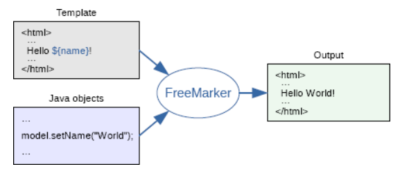

### FreeMarker的入门案例

#### 导入SpringBoot整合FreeMarker的启动器

需要创建Spring Boot+FreeMarker工程用于测试模板。 

~~~xml
<dependency>
    <groupId>org.springframework.boot</groupId>
    <artifactId>spring-boot-starter-freemarker</artifactId>
</dependency>
~~~


#### 视图存放路径

既然整合FreeMarker是自动化配置，就需要我们去了解对FreeMarker进行自动配置的时候我们的视图应该存放在什么目录下呢？

Freemarker 默认默认视图路径文 resources/templates 目录由自动化配置类FreemarkerProperties 类决定


该目录可以进行在application.yml 中进行修改：修改application.yml 添加freemarker 基本配置如下: 

```xml
spring:
    freemarker:
        suffix: .ftl # 修改后缀
        content-type: text/html   # 此为默认类型，不设置也没有关系
        charset: UTF-8
        template-loader-path: classpath:/views/ # 修改存放目录,不修改默认就是templates下
```

PS：springboot 2.2.0版本以后，freemaker模版引擎默认的模版文件后缀名由**ftl**改变为**ftlh**。若使用ftl将无法正常映射与展示。ftlh，使freemarker默认以html内容转码输出，以利于模板输出的安全。

#### 创建Controller

编写FreemarkerController 控制器转发视图

~~~java
package com.msb.controller;

import jakarta.servlet.http.HttpServletRequest;
import org.springframework.stereotype.Controller;
import org.springframework.web.bind.annotation.RequestMapping;

/**
 * @Author: zhaoss
 */

@Controller
public class MyController {
    @RequestMapping("/test1")
    public String test1(HttpServletRequest req){
        req.setAttribute("msg","msb");
        //返回模板文件名称
        return "test1";
    }
}

~~~

#### 创建Freemarker模板

在resources/views目录下创建test1.ftl文件

~~~java
hi test1.ftl <br>
${msg}
~~~


启动服务器，访问：http://localhost:8080/test1


### FreeMarker语法

之前在JavaEE中讲过，参见FreeMarker笔记即可。


## 案例-SpringBoot整合MyBatis完成CRUD

### 创建新模块，编写pom.xml

加入启动器：

```xml
<?xml version="1.0" encoding="UTF-8"?>
<project xmlns="http://maven.apache.org/POM/4.0.0" xmlns:xsi="http://www.w3.org/2001/XMLSchema-instance"
         xsi:schemaLocation="http://maven.apache.org/POM/4.0.0 https://maven.apache.org/xsd/maven-4.0.0.xsd">
    <modelVersion>4.0.0</modelVersion>
    <parent>
        <groupId>org.springframework.boot</groupId>
        <artifactId>spring-boot-starter-parent</artifactId>
        <version>3.1.1</version>
        <relativePath/> <!-- lookup parent from repository -->
    </parent>
    <groupId>com.msb</groupId>
    <artifactId>SpringBootM7</artifactId>
    <version>0.0.1-SNAPSHOT</version>
    <name>SpringBootM7</name>
    <description>SpringBootM7</description>
    <properties>
        <java.version>17</java.version>
    </properties>
    <dependencies>
        <!--引入spring启动器——web开发的起步依赖-->
        <dependency>
            <groupId>org.springframework.boot</groupId>
            <artifactId>spring-boot-starter-web</artifactId>
        </dependency>
        <!--引入Mybatis启动器——用于整合Mybatis-->
        <dependency>
            <groupId>org.mybatis.spring.boot</groupId>
            <artifactId>mybatis-spring-boot-starter</artifactId>
            <version>3.0.2</version>
        </dependency>
        <!--引入mysql 驱动-->
        <dependency>
            <groupId>com.mysql</groupId>
            <artifactId>mysql-connector-j</artifactId>
            <scope>runtime</scope>
        </dependency>
        <!--简化 JavaBean 的编写,引入lombok-->
        <dependency>
            <groupId>org.projectlombok</groupId>
            <artifactId>lombok</artifactId>
            <optional>true</optional>
        </dependency>


        <dependency>
            <groupId>org.springframework.boot</groupId>
            <artifactId>spring-boot-starter-test</artifactId>
            <scope>test</scope>
        </dependency>
    </dependencies>

    <build>
        <plugins>
            <plugin>
                <groupId>org.springframework.boot</groupId>
                <artifactId>spring-boot-maven-plugin</artifactId>
            </plugin>
        </plugins>
    </build>

</project>

```

### 配置文件编写

application.yml:

```yml
# 数据源（数据库连接池） 配置
spring:
  datasource:
    driver-class-name: com.mysql.cj.jdbc.Driver
    url: jdbc:mysql://127.0.0.1:3306/msbsys?characterEncoding=utf8&useSSL=false&serverTimezone=Asia/Shanghai
    username: root
    password: root

mybatis:
  mapper-locations: classpath:mapper/*.xml #mapper.xml放入resources目录下，加入mapper.xml的扫描
  type-aliases-package: com.msb.pojo    #设置实体类别名

# 不改变日志类型和日志规则 只开启mybatis中对应SQL的日志
logging:
  level:
     com.msb.mapper: trace

```


### 构建实体类

```java
package com.msb.pojo;

import lombok.AllArgsConstructor;
import lombok.Data;
import lombok.NoArgsConstructor;

/**
 * @Author: zhaoss
 */
@NoArgsConstructor
@AllArgsConstructor
@Data
public class User {
    private Integer uid;
    private String uname;
    private String pwd;
    private String realname;
    private Integer identity;
}

```

### 编写mapper层

接口：

```java
package com.msb.mapper;


import com.msb.pojo.User;

import java.util.List;

/**
 * @Author: zhaoss
 */

public interface UserMapper {
    // 查询：查询一条用户数据：
    User selectOneUser(Integer uid);
    // 保存：保存一条用户信息：
    int save(User user);
    // 更新：更新一条用户信息：
    int update(User user);
    // 删除：根据id删除一条用户记录：
    int delete(Integer uid);
}

```

mapper.xml:

```xml
<?xml version="1.0" encoding="UTF-8" ?>
<!DOCTYPE mapper
        PUBLIC "-//mybatis.org//DTD Mapper 3.0//EN"
        "https://mybatis.org/dtd/mybatis-3-mapper.dtd">
<mapper namespace="com.msb.mapper.UserMapper">
    <select id="selectOneUser" parameterType="int" resultType="User">
        select * from t_user where uid = #{arg0}
    </select>

    <insert id="save" parameterType="User">
        insert into
        t_user
        (uid,uname,pwd)
        values
        (#{uid},#{uname},#{pwd})
    </insert>

    <update id="update" parameterType="User">
        update
        t_user
        set
        uname =#{uname},pwd=#{pwd}
        where
        uid = #{uid}
    </update>


    <delete id="delete" parameterType="int">
        delete from
        t_user
        where
        uid=#{arg0}
    </delete>
</mapper>
```


### 编写service层

接口：

```java
package com.msb.service;

import com.msb.pojo.User;

/**
 * @Author: zhaoss
 */

public interface UserService {

    User findOneUser(Integer uid);
    int save(User user);
    int update(User user);
    int deleteUserById(Integer uid);
}

```

实现类：

```java
package com.msb.service.impl;

import com.msb.pojo.User;
import com.msb.service.UserService;
import com.msb.mapper.UserMapper;
import org.springframework.beans.factory.annotation.Autowired;
import org.springframework.stereotype.Service;


/**
 * @Author: zhaoss
 */
@Service
public class UserServiceImpl implements UserService {
    @Autowired
    private UserMapper userMapper;

    public User findOneUser(Integer uid){
        return userMapper.selectOneUser(uid);
    }

    @Override
    public int save(User user) {
        return userMapper.save(user);
    }

    @Override
    public int update(User user) {
        return userMapper.update(user);
    }

    @Override
    public int deleteUserById(Integer uid) {
        return userMapper.delete(uid);
    }
}

```


### 编写controller层

```java
package com.msb.controller;

import com.msb.pojo.User;
import com.msb.service.UserService;
import org.springframework.beans.factory.annotation.Autowired;
import org.springframework.stereotype.Controller;
import org.springframework.web.bind.annotation.*;

/**
 * @Author: zhaoss
 */
@Controller
public class UserController {
    @Autowired
    private UserService userService;

    @GetMapping("/user/{uid}")
    @ResponseBody
    public User select(@PathVariable Integer uid){
        return userService.findOneUser(uid);
    }

    @PostMapping("/user")
    @ResponseBody
    public int save(@RequestBody User user){
        return userService.save(user);
    }

    @PutMapping("/user")
    @ResponseBody
    public int update(@RequestBody User user){
        return userService.update(user);
    }
    @DeleteMapping("/user/{uid}")
    @ResponseBody
    public int delete(@PathVariable Integer uid){
        return userService.deleteUserById(uid);
    }


}

```

### 启动类

```java
@SpringBootApplication
@MapperScan("com.msb.mapper")
public class SpringBootM7Application{

    public static void main(String[] args) {
        SpringApplication.run(SpringBootM7Application.class, args);
    }
}

```

### 测试访问

 在企业 web 应用开发中，对服务器端接口进行测试，通常借助接口测试工具，这里使用 **Postman 接口测试工具**来对后台 restful 接口进行测试。 

​	Postman 工具下载地址 ： https://www.getpostman.com/apps ，选中对应平台下载即可。

​	下载、安装、注册账号，自行完成即可。

​    启动 Postman 根据后台接口地址发送响应请求即可对接口进行测试。

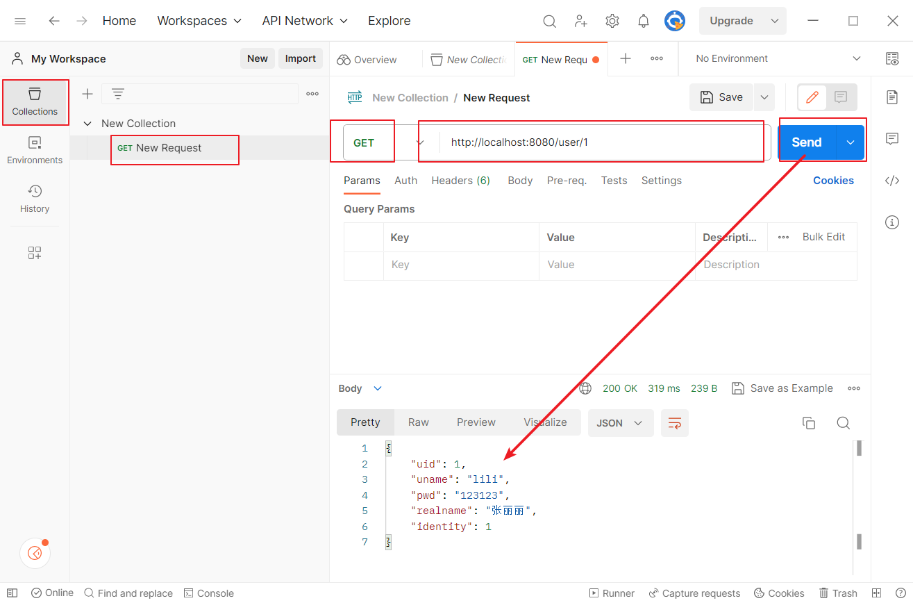

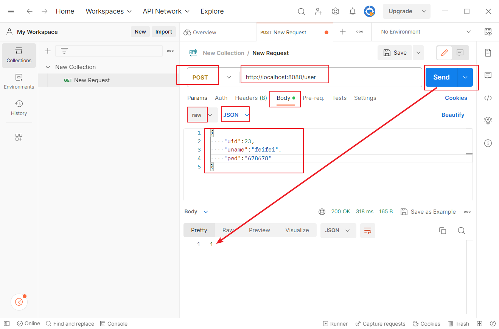


## SpringBoot整合PageHelper

SpringBoot整合PageHelper完成分页，可直接利用上面整合代码进行测试。

PageHelper是一个Mybatis分页插件，官网：https://pagehelper.github.io/


现在SpringBoot整合PageHelper完成分页使用非常简单的（以前搞依赖，配置拦截器）

先在pom.xml中导入启动器：**(SpringBoot3 必须整合  1.4.6以上版本，否则不好使)**

```xml
<dependency>
    <groupId>com.github.pagehelper</groupId>
    <artifactId>pagehelper-spring-boot-starter</artifactId>
    <version>1.4.6</version>  
</dependency>
```

### 编写mapper层

接口：

```java
public interface UserMapper {
    List<User> selectAllUsers();
}
```

mapper.xml:

```xml
<?xml version="1.0" encoding="UTF-8" ?>
<!DOCTYPE mapper
        PUBLIC "-//mybatis.org//DTD Mapper 3.0//EN"
        "https://mybatis.org/dtd/mybatis-3-mapper.dtd">
<mapper namespace="com.msb.mapper.UserMapper">


    <select id="selectAllUsers">
        select
        *
        from
        t_user
    </select>

    
</mapper>
```


### 编写业务层

接口：

```java

public interface UserService {

    /**
     *
     * @param pageNum 页码
     * @param pageSize 每页数据大小
     * @return
     */
    PageInfo<User> findAllUsers(int pageNum, int pageSize);
}

```

实现类：

```java
package com.msb.service.impl;

import com.github.pagehelper.PageHelper;
import com.github.pagehelper.PageInfo;
import com.msb.pojo.User;
import com.msb.service.UserService;
import com.msb.mapper.UserMapper;
import org.springframework.beans.factory.annotation.Autowired;
import org.springframework.stereotype.Service;

import java.util.List;


/**
 * @Author: zhaoss
 */
@Service
public class UserServiceImpl implements UserService {

    @Override
    public PageInfo<User> findAllUsers(int pageNum, int pageSize) {
        PageHelper.startPage(pageNum,pageSize);
        List<User> users = userMapper.selectAllUsers();
       
        // PageInfo是分页查询所有查询结果封装的类，所有的结果都从这个类取
        // 使用PageInfo包装查询后的结果,只需要将PageInfo交给页面就行。
        PageInfo<User> info = new PageInfo<>(users);

        return info;
    }
}
```

### 编写控制层

```java
package com.msb.controller;

import com.github.pagehelper.PageInfo;
import com.msb.pojo.User;
import com.msb.service.UserService;
import org.springframework.beans.factory.annotation.Autowired;
import org.springframework.stereotype.Controller;
import org.springframework.web.bind.annotation.*;

/**
 * @Author: zhaoss
 */
@Controller
public class UserController {
    @Autowired
    private UserService userService;

   
    @GetMapping("/user/list")
    @ResponseBody
    public PageInfo<User> selectAll(int pageNum,int pageSize){
        return userService.findAllUsers(pageNum,pageSize);
    }

}
```

postman：

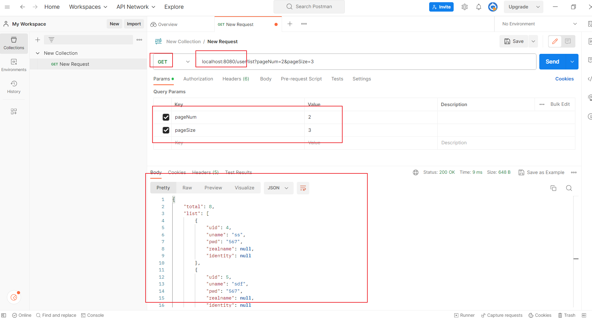


```
{
    "total": 8,
    "list": [
        {
            "uid": 4,
            "uname": "ss",
            "pwd": "567",
            "realname": null,
            "identity": null
        },
        {
            "uid": 5,
            "uname": "sdf",
            "pwd": "567",
            "realname": null,
            "identity": null
        },
        {
            "uid": 6,
            "uname": "fd",
            "pwd": "789",
            "realname": null,
            "identity": null
        }
    ],
    "pageNum": 2,  
    "pageSize": 3, 
    "size": 3,  
    "startRow": 4,   
    "endRow": 6,
    "pages": 3,
    "prePage": 1,
    "nextPage": 3,
    "isFirstPage": false,
    "isLastPage": false,
    "hasPreviousPage": true,
    "hasNextPage": true,
    "navigatePages": 8,
    "navigatepageNums": [
        1,
        2,
        3
    ],
    "navigateFirstPage": 1,
    "navigateLastPage": 3
}
```

表示含义：

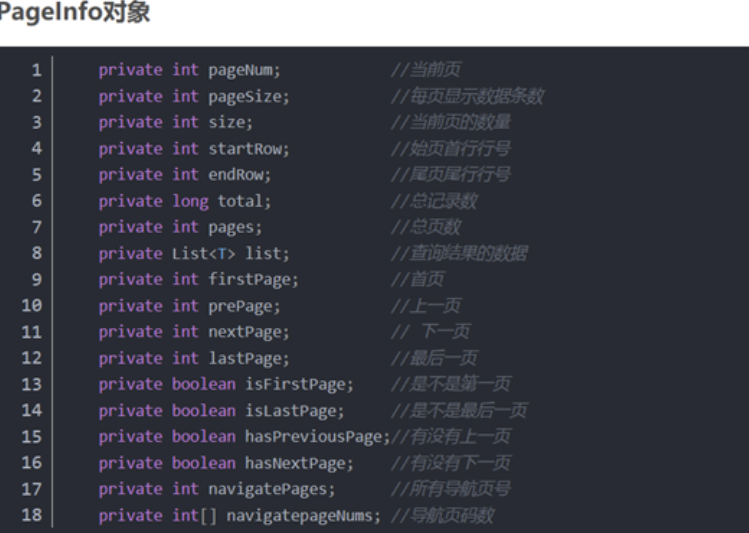

查看日志中sql：

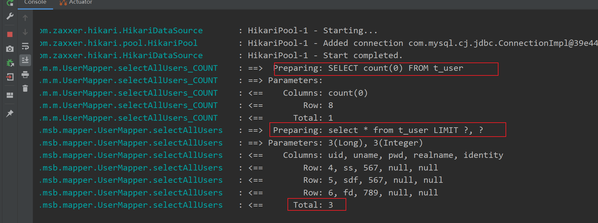