SpringBoot - 第二天

## 学习目标

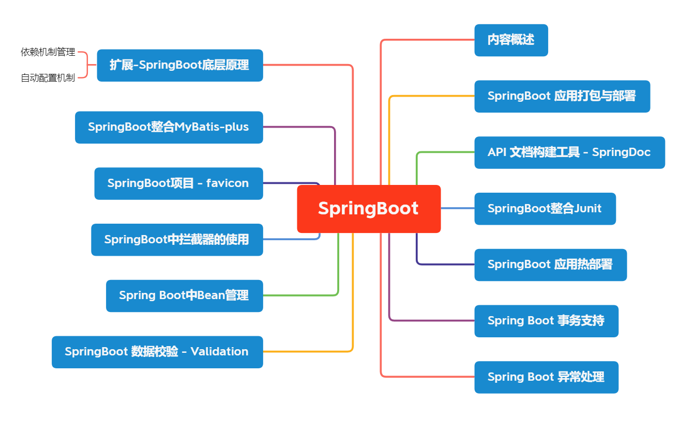

## SpringBoot 应用打包与部署

​	当项目开发完毕进行部署上线时，需要对项目进行打包操作，SpringBoot中提供了两种方式，可以打jar包部署、也可以打war包部署。

### Jar 包部署

  上述中构建的项目属于普通应用，由于 SpringBoot 内嵌 Tomcat 容器，所有打包后的 jar 包默认可以自行运行。

#### 配置打包命令

​	idea 下配置 `clean compile package -Dmaven.test.skip=true` 执行打jar包的命令，这样在target 目录中就可以得到待部署的项目文件。

   第一步：找到edit configurations


 第二步：点击+号，选择maven


第三步：配置命令


第四步 ：执行命令


第五步：执行命令后在target下可以找到jar包


jar包有了，如何运行这个jar文件呢？

#### 部署并访问

​	打开本地 dos 窗口，执行 java -jar 命令 部署已打好的 jar 包文件。

​	命令如下：`java -jar jar包所在目录`

   jar包所在目录如何获取：


执行命令：


服务器启动好，访问：


### war 包部署

​	War 包形式部署 Web 项目在生产环境中是比较常见的部署方式，也是目前大多数 web 应用部署的方案，这里要对 Spring Boot Web 项目进行打包部署步骤如下

#### pom.xml修改

- 应用类型修改

  由于之前的项目构建为普通工程，默认为 jar 应用，所以这里打 war 需要作如下修改：
  
  


- 忽略内嵌tomcat

   SpringBoot工程的项目，内嵌了tomcat（构建 SpringBoot 应用时，引入的 spring-boot-starter-web 默认引入 Tomcat 容器），此时我们需要借助外部的tomcat部署项目，所以在这里需要忽略掉内置的tomcat。
   
   ```xml
   <dependency>
       <groupId>org.springframework.boot</groupId>
       <artifactId>spring-boot-starter-tomcat</artifactId>
       <scope>provided</scope>
   </dependency>
   ```
   
   

#### Starter 修改

​     war包需要指定程序的执行入口， 添加容器启动加载文件 (类似于读取 web.xml)，这里通过继承 SpringBootServletInitializer 类并重写 configure 方法来实现，在部署项目时指定外部 Tomcat 读取项目入口方法。

修改启动类：

```java
package com.msb;

import org.mybatis.spring.annotation.MapperScan;
import org.springframework.boot.SpringApplication;
import org.springframework.boot.autoconfigure.SpringBootApplication;
import org.springframework.boot.builder.SpringApplicationBuilder;
import org.springframework.boot.web.servlet.support.SpringBootServletInitializer;

@SpringBootApplication
@MapperScan("com.msb.mapper")
public class SpringBootM7Application extends SpringBootServletInitializer {

    public static void main(String[] args) {
        SpringApplication.run(SpringBootM7Application.class, args);
    }
    // 告诉web容器这就是程序的启动入口
    @Override
    protected SpringApplicationBuilder configure(SpringApplicationBuilder builder) {
        return builder.sources(SpringBootM7Application.class);
    }
}
```


#### 打包操作

执行命令，生成对应的 war 包


#### 部署并访问

- 在外部tomcat部署并访问

  将上面的war包复制粘贴到tomcat的webapps目录下：

  

- 启动tomcat

  

  启动tomcat时会自动帮我们解压war包：

  

- 浏览器访问


观察目录：


## API 文档构建工具 - SpringDoc

​	进行web开发，web工程有后端、有前端，前端调用后端接口，对接调用后端接口来展示数据到前端。当后端接口开发完毕，怎么有效的让客户端进行调用呢？就需要后端提供一套有效的API文档，借着这个文档前端进行对接操作。

​	OpenAPI规范（其前身叫Swagger规范）是Linux基金会的一个开源项目，试图通过定义一种用来描述API格式或API定义的语言，来规范RESTful服务开发过程。OpenAPI规范规定了一个API必须包含的基本信息。即：OpenAPI是规范。

​	Swagger就是一款经典的API 文档构建工具， Swagger 其实也是 OpenAPI 的一个实现，使用 Swagger的话，springboot 项目里面需要引入 springfox 的依赖，但是集成SpringFox只支持[SpringBoot2](https://so.csdn.net/so/search?q=SpringBoot2&spm=1001.2101.3001.7020).x，SpringFox自从2020年7月14号之后就不更新了，对于高版本的Spring Boot，推荐使用springdoc-openapi，SpringDoc 是 OpenAPI 的另一个实现，基于[Swagger](https://so.csdn.net/so/search?q=Swagger&spm=1001.2101.3001.7020)的SpringDoc的社区现在十分活跃，代码也在不断更新。SpringDoc基于swagger，并做了更多的对Spring系列各框架的兼容，用法上与Swagger3基本相同，并多了一些自己的配置，相较于Swagger3来说，更好用，支持也更好一点，springdoc 的底层是 swagger3。借助API 文档构建工具就可以快速的生成文档，省去人工编写的时间。

### 环境整合配置

- pom.xml中添加springdoc依赖


```xml
<dependency>
     <groupId>org.springdoc</groupId>
     <artifactId>springdoc-openapi-starter-webmvc-ui</artifactId>
     <version>2.1.0</version>
</dependency>
```

- 配置类添加

这里和[Swagger配置](https://so.csdn.net/so/search?q=Swagger配置&spm=1001.2101.3001.7020)类似，主要是配置接口的标题、描述、版本信息等。


```java
package com.msb.config;


import io.swagger.v3.oas.models.OpenAPI;
import io.swagger.v3.oas.models.info.Info;
import org.springframework.context.annotation.Bean;
import org.springframework.context.annotation.Configuration;


/**
 * @Author: zhaoss  
 */
@Configuration
public class SpringDocConfig {

    @Bean
    public OpenAPI restfulOpenAPI() {
        Info info = new Info().title("SpringBoot项目")
                .description("用户管理项目")
                .version("1.0.0");
        return new OpenAPI()
                .info(info);
    }

}
```

### SpringDoc常用注解说明

利用注解标注在接口的方法上，给方法添加说明信息。SpringDoc会借助相应的注解来生成对应的帮助文档。因为你自己写后端，每个方法什么意思你比较清楚，即便是很简单的方法，前端人员是不清晰的。

#### @Tag

```java
@Tag：作用-用在请求的类上，说明该类的作用
    配置参数name="该类对应的模块名字 "tags="说明该类的作用，对模块进行描述"
```

```java
@Tag(name = "用户模块管理", description = "用户接口")
```

#### @Operation

```csharp
@Operation：作用-用在请求的方法上，说明方法的作用
    配置参数summary="说明方法的作用"
```

```java
@Operation(summary="用户模块-根据用户id查询用户信息")
```

#### @Parameters

```dart
@Parameters：作用-用在请求的方法上，对请求的参数（方法的形参）进行说明，是一个复合注解，里面包含了多个@Parameter子注解。
    @Parameter：用在 @Parameters 注解中，指定一个请求参数的配置信息   
    	注解的属性介绍：（配置参数）
        name：参数名
        value：参数的汉字说明、解释
        required：参数是否必须传
```

如果方法是一个参数，可以直接使用@Parameter注解：

```java
@Parameter(name="uid",description ="查询参数用户id",required = true)
public User select(@PathVariable Integer uid){
	return userService.findOneUser(uid);
}
```

如果多个参数，可以使用@Parameters，如：

```java
@Parameters({
    @Parameter(name="mobile",description="手机号",required=true),
    @Parameter(name="password",description="密码",required=true),
    @Parameter(name="age",description="年龄",required=true)
})
```


#### @ApiResponses

```dart
@ApiResponses：用于请求的方法上，表示一组响应，，是一个复合注解，里面包含了多个@ApiResponse子注解。
    @ApiResponse：用在@ApiResponses中，一般用于表达一个错误的响应信息
        code：数字，例如400
        message：信息，例如"请求参数没填好"
        response：抛出异常的类
```

```css
@ApiResponses({
    @ApiResponse(code=400, message="请求参数没填好"),
    @ApiResponse(code=404, message="请求路径没有或页面跳转路径不对")
})
```

#### @Schema

用在模型类上,对模型类做注释; 用在属性上,对属性做注释 ;

```dart
package com.msb.pojo;


import io.swagger.v3.oas.annotations.media.Schema;
import lombok.AllArgsConstructor;
import lombok.Data;
import lombok.NoArgsConstructor;

/**
 * @Author: zhaoss
 */
@NoArgsConstructor
@AllArgsConstructor
@Data
@Schema(description = "用户实体类")
public class User {
    @Schema(description = "用户id主键")
    private Integer uid;
    @Schema(description =  "用户名字")
    private String uname;
    @Schema(description =  "账户密码")
    private String pwd;
    @Schema(description =  "真实名字")
    private String realname;
    @Schema(description = "身份标识")
    private Integer identity;
}

```


### 用户模块注解配置

注解的使用案例：

#### 在Controller 上使用注解

```java
package com.msb.controller;

import com.github.pagehelper.PageInfo;
import com.msb.pojo.User;
import com.msb.service.UserService;

import io.swagger.v3.oas.annotations.Operation;
import io.swagger.v3.oas.annotations.Parameter;
import io.swagger.v3.oas.annotations.tags.Tag;
import org.springframework.beans.factory.annotation.Autowired;
import org.springframework.stereotype.Controller;
import org.springframework.web.bind.annotation.*;

/**
 * @Author: zhaoss
 */
@Controller
@Tag(name = "用户模块管理", description = "用户接口")
public class UserController {
    @Autowired
    private UserService userService;

    @GetMapping("/user/{uid}")
    @ResponseBody
    @Operation(summary="用户模块-根据用户id查询用户信息")
    @Parameter(name="uid",description ="查询参数用户id",required = true)
    public User select(@PathVariable Integer uid){
        return userService.findOneUser(uid);
    }

    @PostMapping("/user")
    @Parameter(name = "user",description = "用户信息",required = true)
    @ResponseBody
    @Operation(summary="用户模块-保存用户信息")
    public int save(@RequestBody User user){
        return userService.save(user);
    }

    @PutMapping("/user")
    @ResponseBody
    @Operation(summary="用户模块-更新用户信息")
    public int update(@RequestBody User user){
        return userService.update(user);
    }
    @DeleteMapping("/user/{uid}")
    @ResponseBody
    @Operation(summary="用户模块-根据用户id删除用户信息")
    public int delete(@PathVariable Integer uid){
        return userService.deleteUserById(uid);
    }

    @GetMapping("/user/list")
    @ResponseBody
    @Operation(summary="用户模块-查询用户信息用来分页")
    public PageInfo<User> selectAll(int pageNum,int pageSize){
        return userService.findAllUsers(pageNum,pageSize);
    }

}

```

#### 在JavaBean上 使用注解

- User.java

```java
package com.msb.pojo;

/*import io.swagger.annotations.ApiModel;
import io.swagger.annotations.ApiModelProperty;*/
import io.swagger.v3.oas.annotations.media.Schema;
import lombok.AllArgsConstructor;
import lombok.Data;
import lombok.NoArgsConstructor;

/**
 * @Author: zhaoss
 */
@NoArgsConstructor
@AllArgsConstructor
@Data
@Schema(description = "用户实体类")
public class User {
    @Schema(description = "用户id主键")
    private Integer uid;
    @Schema(description =  "用户名字")
    private String uname;
    @Schema(description =  "账户密码")
    private String pwd;
    @Schema(description =  "真实名字")
    private String realname;
    @Schema(description = "身份标识")
    private Integer identity;
}

```


###  接口文档访问

启动工程，浏览器访问 ：

swagger 文档形式访问在以下 URL 中提供：http://localhost:8080/swagger-ui/index.html。

json 格式的 OpenAPI 3.0.1 描述将在以下 URL 中提供： http://localhost:8080/v3/api-docs 。

yaml 格式在以下 URL 中提供： http://localhost:8080/v3/api-docs.yaml。

对于 HTML 格式的 swagger 文档的自定义路径，在 config 文件中添加自定义 springdoc 属性：

```
# swagger-ui custom path
springdoc.swagger-ui.path=/swagger-ui.html
```


我们一般使用：http://localhost:8080/swagger-ui/index.html，查看生成的接口文档，查看文档说明信息：


具体的方法：


测试方法：点击try it  out:


查询方法测试：

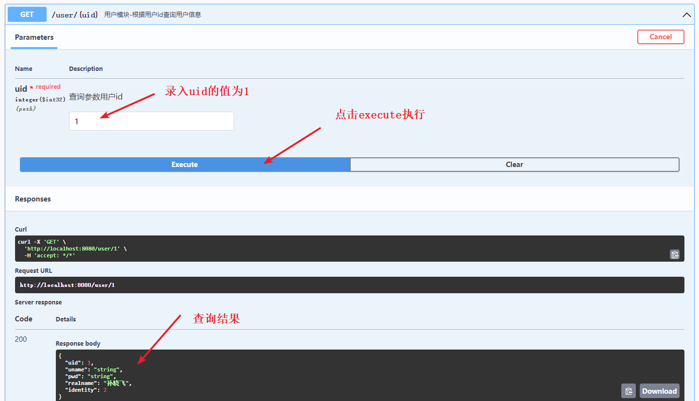


## SpringBoot整合Junit

​	做过 web 项目开发的对于单元测试都并不陌生了，通过它能够快速检测业务代码功能的正确与否，SpringBoot 框架对单元测试也提供了良好的支持，来看 SpringBoot 应用中单元测试的使用。

###  启动器

进行单元测试，我们在利用模板快速构建项目的时候，其实已经帮我们把SpringBoot整合Junit5整合好了，默认导入了启动器：

```
<dependency>
    <groupId>org.springframework.boot</groupId>
    <artifactId>spring-boot-starter-test</artifactId>
    <scope>test</scope>
</dependency>
```

### 测试类	

在src/main/test里面已经帮我们构建好测试类了：


测试类内容默认为：

```java
package com.msb;

import org.junit.jupiter.api.Test;
import org.springframework.boot.test.context.SpringBootTest;

@SpringBootTest
class SpringBootM7ApplicationTests {

    @Test
    void contextLoads() {
    }

}

```

<font color='red'>注意：</font>

1. 测试类不能叫做Test
2. 测试方法必须是public/default
3. 测试方法返回值必须是void
4. 测试方法必须没有参数

### 对service层业务方法的测试

```java
package com.msb;

import com.msb.service.UserService;
import org.junit.jupiter.api.AfterEach;
import org.junit.jupiter.api.BeforeEach;
import org.junit.jupiter.api.Test;
import org.springframework.beans.factory.annotation.Autowired;
import org.springframework.boot.test.context.SpringBootTest;

@SpringBootTest
class SpringBootM7ApplicationTests {

    @Autowired
    private UserService userService;
    @Test
    void contextLoads() {
        System.out.println(userService.findOneUser(1));
    }

    @BeforeEach
    public void before(){
        System.out.println("单元测试开始...");
    }

    @AfterEach
    public void after(){
        System.out.println("单元测试结束...");
    }

}

```


结果：


@SpringBootTest注解作用：会找到启动类走一下，启动类中进行扫描才会构建对象，构建对象以后在测试类内部才可以注入对象。


注意:在springBoot2.4之前 使用整合单元测试需要写 @SpringBootTest (classes={启动器类名.class})和RunWith(SpringRunner.class)

### 对controller层的控制层接口方法测试

在不启动web容器的情况下，可以测试控制层的接口，获取接口响应的内容。

如果不想每次测试都启动容器，然后访问，就可以用单元测试。

```java
package com.msb;

import com.msb.service.UserService;
import org.junit.jupiter.api.AfterEach;
import org.junit.jupiter.api.BeforeEach;
import org.junit.jupiter.api.Test;
import org.springframework.beans.factory.annotation.Autowired;
import org.springframework.boot.test.autoconfigure.web.servlet.AutoConfigureMockMvc;
import org.springframework.boot.test.context.SpringBootTest;
import org.springframework.http.MediaType;
import org.springframework.mock.web.MockHttpServletResponse;
import org.springframework.test.web.servlet.MockMvc;
import org.springframework.test.web.servlet.MvcResult;
import org.springframework.test.web.servlet.ResultActions;
import org.springframework.test.web.servlet.request.MockHttpServletRequestBuilder;
import org.springframework.test.web.servlet.request.MockMvcRequestBuilders;
import org.springframework.test.web.servlet.result.MockMvcResultMatchers;
import org.springframework.test.web.servlet.setup.MockMvcBuilders;
import org.springframework.web.context.WebApplicationContext;
import org.springframework.web.util.WebUtils;

import java.net.URI;
import java.nio.charset.Charset;

@SpringBootTest
@AutoConfigureMockMvc  // 测试控制器需要MockMvc的环境
class SpringBootM7ApplicationTests2 {

    @Autowired
    private MockMvc mockMvc;
    @Test
    void contextLoads() throws Exception {
        // 构建请求
        MockHttpServletRequestBuilder request = MockMvcRequestBuilders.get("/user/1")
                .accept(MediaType.APPLICATION_JSON) ;// 指定请求的Accept头信息


        // 发送请求，获取请求结果
        ResultActions perform = mockMvc.perform(request);


        // 请求结果校验
        perform.andExpect(MockMvcResultMatchers.status().isOk());

        // 表示执行完成后返回相应的结果
        MvcResult mvcResult = perform.andReturn();

        // 得到执行后的响应
        MockHttpServletResponse response = mvcResult.getResponse();
        //response.setCharacterEncoding(WebUtils.DEFAULT_CHARACTER_ENCODING);

        System.out.println("响应状态：{}" + response.getStatus());
        System.out.println("响应内容：{}" + response.getContentAsString());
    }

    @BeforeEach
    public void before(WebApplicationContext context){
        System.out.println("单元测试开始...");
        //全局拦截 (推荐)
        //创建mockMvc，增加filter----防止响应内容中文乱码  （下图”孙晓飞“位置）
        mockMvc = MockMvcBuilders.webAppContextSetup(context)
                .addFilter((request, response, chain) -> {
                    response.setCharacterEncoding("UTF-8");
                    chain.doFilter(request, response);
                }, "/*")
                .build();
    }

    @AfterEach
    public void after(){
        System.out.println("单元测试结束...");
    }

}

```


## SpringBoot 应用热部署

在前面我们 sping boot的代码开发过程中，大家会注到一个现象：在项目开发过程中，常常会改动页面数据或者修改数据结构，每次修改代码就然得重启项目，重新部署，因为新修改的代码，需要进行再次编译后重新部署到Tomcat服务器，这样环境才能识别到你代码的变化，这就属于冷部署。

对于许多复杂的大型应用来说，重启工作需要花费大量的时间，需要重启很多组件、数据库、数据连接池等等，如果是大型分布式项目，又是部署在不同的节点上，又涉及节点与节点的通讯，重启就意味着时间成本的不断堆积。


通过热部署解决问题。

### 什么是热部署？

​	热部署，就是在应用正在运行的时候升级软件（增加业务/修改bug），却不需要重新启动应用，修改后的结果立即生效。


### 热部署原理

​	项目中修改代码后重启的目的：其实就是重新编译生成了新的 Class 文件，这个文件里记录着和代码等对应的各种信息，然后 Class 文件将被虚拟机的 ClassLoader 加载。

​	热部署在原理上是使用了两个 ClassLoader，一个 ClassLoader 加载那些不会改变的类（第三方 Jar 包），另一个ClassLoader 加载会更改的类，称为 restart ClassLoader。它监听到如果有 Class 文件改动了，原来的 restart ClassLoader 被丢弃，重新创建一个 restart ClassLoader，由于需要加载的类相比较少，不需要人工重启服务器，所以实现了较快的重启时间。

​    在Spring Boot项目中 通过配置 DevTools  工具（开发者工具）来达到热部署效果。

 

### 热部署环境配置与测试

热部署环境配置，需要开发者工具-DevTools 

#### 配置 DevTools 环境

- 如果是新项目，选中DevTools 依赖

  

- 不是新项目，就修改 Pom 文件，添加 DevTools 依赖

```xml
<!-- DevTools 的坐标 -->
<dependency>
    <groupId>org.springframework.boot</groupId>
    <artifactId>spring-boot-devtools</artifactId>
    <!--项目运行时生效。表示编译时不参与，但是参与项目的测试、打包。该依赖被打包时会被包含。-->
    <scope>runtime</scope>
    <!--设置为true热部署才生效-->
    <optional>true</optional>
</dependency>
```

​	devtools 可以实现**页面热部署**（即页面修改后会立即生效，这个可以直接在 application.properties 文件中配置 spring.thymeleaf.cache=false 来实现），实现**类文件热部署**（类文件修改后不会立即生效），实现对**属性文件的热部署**。即 devtools 会监听 classpath 下的文件变动，并且会立即重启应用（发生在保存时机），注意：因为其采用的虚拟机机制，该项重启是很快的。配置了后在修改 java 文件后也就支持了热启动，不过这种方式是属于项目重启（速度比较快的项目重启），会清空 session 中的值，也就是如果有用户登陆的话，项目重启后需要重新登陆。

​	默认情况下，/META-INF/maven，/META-INF/resources，/resources，/static，/templates，/public 这些文件夹下的文件修改不会使应用重启，但是会重新加载（ devtools 内嵌了一个 LiveReload server，当资源发生改变时，浏览器刷新）

#### 全局配置文件配置

​	上面只是引入了热部署的依赖，还需要在springboot项目中进行一些基本配置，

​	在 application.yml 中配置 spring.devtools.restart.enabled=false，此时 restart 类加载器还会初始化，但不会监视文件更新。

```yml
spring:
  ## 热部署配置
  devtools:
    restart:
      enabled: true  # 开启热部署
      # 设置热启动路径，这个路径下的内容修改后不需要重启，进行热部署。    
      additional-paths: src/main/java
      # 设置的内容为不让热部署去管理，不需要加载 (其实指的就是编译过的文件，因为热部署只管理变化的内容，编译过的没有变化的内容不加载)
      exclude: WEB-INF/**
```

#### IDEA 配置

​	当我们修改了 Java 类后，IDEA 默认是不自动编译的，而 spring-boot-devtools 又是监测 classpath 下的文件发生变化才会重启应用，所以需要设置 IDEA 的自动编译。

- 自动编译配置

  File -> Settings -> Compiler -> Build Project automatically

  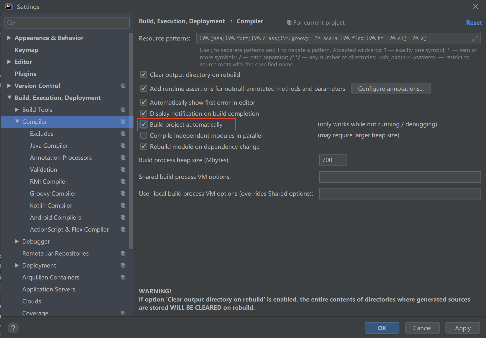

- 高级设置- 属性修改-允许auto-make

允许程序在运行的时候自动编译

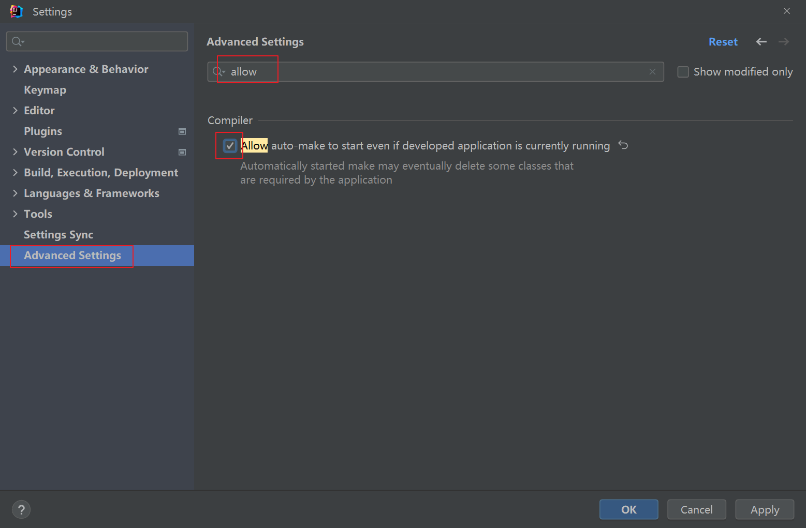


- 关闭浏览器缓存

  不关闭缓存，浏览器可能还用上次的界面，不是新的内容，找到浏览器，开发者工具（f12）-网络-禁用缓存：

  

  

#### 热部署效果测试

- controller层：

  ```java
  package com.msb.controller;
  
  import org.springframework.stereotype.Controller;
  import org.springframework.web.bind.annotation.RequestMapping;
  import org.springframework.web.bind.annotation.ResponseBody;
  
  /**
  @Author: zhaoss
  */
  @Controller
   public class MyController {
     @RequestMapping("/test")
     @ResponseBody
     public String test(){
         return "test hi devtools..";
     }
   }
  ```

  启动服务器，运行，正常，没问题

  

- 修改接口代码 

  如：新增控制台打印内容参数


  ```java
  package com.msb.controller;
  
  import org.springframework.stereotype.Controller;
  import org.springframework.web.bind.annotation.RequestMapping;
  import org.springframework.web.bind.annotation.ResponseBody;
  
  /**
   * @Author: zhaoss
  */
  @Controller
    public class MyController {
          @RequestMapping("/test")
        @ResponseBody
          public String test(){
              System.out.println("启动服务器后修改方法中内容");
              return "test hi devtools..";
          }
      }
  
  ```

  开启自动热部署后，修改业务代码，当**IDEA失去焦点**5秒钟后，就会自动进行构建

  

  

​          或者<font color='red' size='6'>ctrl+f9</font> 键重新编译，浏览器访问即可


验证：

（1）修改java代码，热部署生效

（2）增加静态文件，热部署生效

（3）修改配置文件，热部署生效


## Spring Boot 事务支持

​    我们在Spring的时候就学习过事务的处理，Spring 并不直接管理事务，而是提供了多种事务管理器，Spring 事务管理器的接口是org.springframework.transaction.PlatformTransactionManager，通过这个接口，Spring 为各个平台如 JDBC、Hibernate 等都提供了对应的事务管理器。

​     如果应用程序中直接使用 JDBC 来进行持久化，此时使用 DataSourceTransactionManager 来处理事务边界。DataSourceTransactionManager 就是PlatformTransactionManager的一个具体实现。


​     如果 Spring Boot 集成了 mybatis 框架，mybatis  底层数据访问层实现基于 jdbc 来实现，也是使用 DataSourceTransactionManager 来处理事务边界。

​	  在Spring中如何处理事务的还记得吗？可以使用xml配置或者注解配置。

​	 Spring Boot 应用启动时自动进行配置，事务的处理非常简单，直接使用注解配置即可，无需xml配置内容。


​	 案例：随便找到一个SpringBoot整合Mybatis的案例，在service中先不加事务控制：

```java
/**
 * @Author: zhaoss
 */
@Service
public class UserServiceImpl implements UserService {
    @Autowired
    private UserMapper userMapper;

    @Override
    public int deleteUserById(Integer uid) {
        int num = userMapper.delete(uid);
        int a = 1/0;
        return num;
    }

}

```

启动服务器，利用postman测试：


发现，数据库数据被删除，但是后台报错：


所以必须要加入事务的控制：

```java
package com.msb.service.impl;

import com.github.pagehelper.PageHelper;
import com.github.pagehelper.PageInfo;
import com.msb.pojo.User;
import com.msb.service.UserService;
import com.msb.mapper.UserMapper;
import org.springframework.beans.factory.annotation.Autowired;
import org.springframework.stereotype.Service;
import org.springframework.transaction.annotation.Propagation;
import org.springframework.transaction.annotation.Transactional;

import java.util.List;


/**
 * @Author: zhaoss
 */
@Service
public class UserServiceImpl implements UserService {
    @Autowired
    private UserMapper userMapper;


    @Override
    @Transactional(propagation= Propagation.REQUIRED)
    public int deleteUserById(Integer uid) {
        int num = userMapper.delete(uid);
        int a = 1/0;
        return num;
    }

}

```

启动服务器，测试，发现程序报错，数据库数据没有被删除，证明事务加入成功，非常简单的操作！在service层每个增删改方法前都加入@Transactional(propagation = Propagation.REQUIRED)注解即可。


## Spring Boot 异常处理

### 异常处理的方式

- 方式1：try\catch\finally throw\throws

- 方式2：如发生异常跳转到异常处理页面

  如：在servlet、jsp中学习的在web.xml中配置-出现某种异常跳转入指定页面

```xml
<error-page>
    <error-code>500</error-code>
    <location>/error500.JSP</location>
</error-page>
<error-page>
    <error-code>404</error-code>
    <location>/error404.JSP</location>
</error-page>
```

- 方式3：配置方式处理

  在springmvc中学习过异常的处理方式：

  A.@ExceptionHandler 实现局部异常处理

  B.@ControllerAdvice、@ExceptionHandler实现全局异常处理(以后用的最多)

  C.xml配置实现全局异常处理

```xml
<!--自定义异常解析器-->
<bean id="exceptionResolver" class="org.springframework.web.servlet.handler.SimpleMappingExceptionResolver">
    <property name="exceptionMappings">
        <props>
            <prop key="java.lang.ArithmeticException">redirect:/error.jsp</prop>
            <prop key="java.lang.NullPointerException">redirect:/error2.jsp</prop>
        </props>
    </property>
</bean>	
```

​		在Spring Boot 应用中同样提供了对异常的处理方式，我们着重讲方式2、方式3中对应的springboot中的异常处理方式。

### 方式2：如发生异常跳转到异常处理页面

在com.msb.controller控制层制造一个异常：

```java
package com.msb.controller;

import org.springframework.stereotype.Controller;
import org.springframework.web.bind.annotation.RequestMapping;

/**
 * @Author: zhaoss
 */
@Controller
public class MyController {
    @RequestMapping("/test1")
    @ResponseBody
    public String test1(){
        int a = 1/0;
        return "test1";
    }
}

```

在resources/templates下加入异常处理界面：

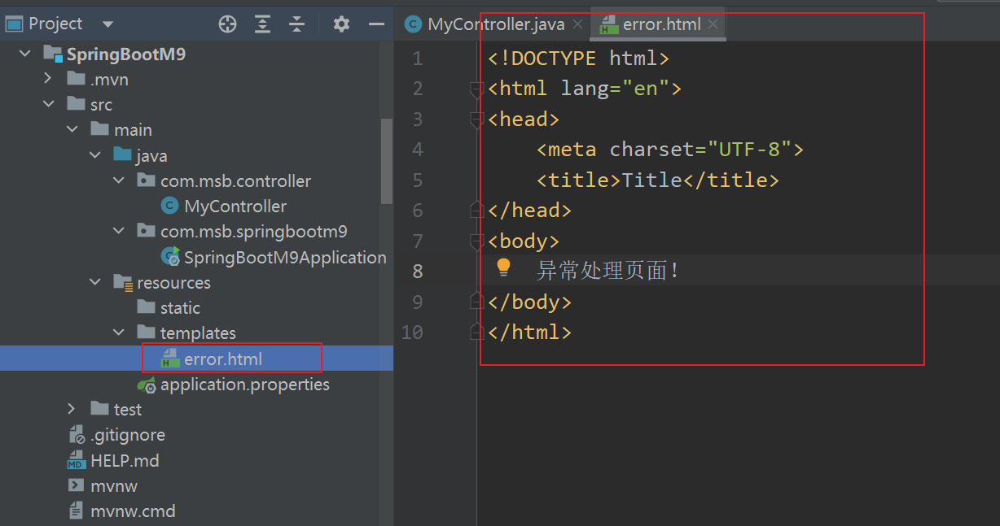

如果你整合的是thymeleaf就创建error.html，如果你整合的是freemarker你就创建error.ftl,SpringBoot会自动帮你跳转到异常页面。

启动服务器访问页面：


如果你想不同的异常跳转到不同的页面，可以做如下处理：


页面名字为即将出现错误的状态码。

运行就会跳转入对应的页面：


PS：执行顺序，先找error目录下，如果没有再找templates目录下。


上面的方式只是做了页面的跳转，但是并没有将异常做处理，下面的方式可以处理异常：

### 方式3：配置方式处理 - A.@ExceptionHandler 实现局部异常处理

在com.msb.controller.MyController中加入异常处理方法，使用@ExceptionHandler注解：

```java
package com.msb.controller;

import org.springframework.stereotype.Controller;
import org.springframework.web.bind.annotation.ExceptionHandler;
import org.springframework.web.bind.annotation.RequestMapping;
import org.springframework.web.bind.annotation.ResponseBody;

/**
 * @Author: zhaoss
 */
@Controller
public class MyController {
    @RequestMapping("/test1")
    @ResponseBody
    public String test01(){
        System.out.println("test1---");
        int a = 1/0;
        return "test01";
    }

    // 出现算术异常，跳转到如下方法解决：
    @ExceptionHandler(value = {java.lang.ArithmeticException.class})
    public String myexceptionhandler(){
        System.out.println("异常处理逻辑代码。。");
        return "myerror";
    }
}

```

加入myerror.html界面：


启动服务器运行：


上面这种处理方式属于局部处理方式，只对当前MyController控制单元中的异常生效，所以我们需要加入全局异常处理：

### 方式3：配置方式处理 - B.@ControllerAdvice、@ExceptionHandler实现全局异常处理

创建com.msb.exceptionhandler包，加入异常处理类，使用@ControllerAdvice、@ExceptionHandler注解：

```java
package com.msb.exceptionhandler;

import org.springframework.web.bind.annotation.ControllerAdvice;
import org.springframework.web.bind.annotation.ExceptionHandler;

/**
 * @Author: zhaoss
 */
@ControllerAdvice // 代表当前类为异常处理类
public class GlobalExceptionHandler {
    // 出现算术异常，跳转到如下方法解决：
    @ExceptionHandler(value = {java.lang.ArithmeticException.class})
    public String myexceptionhandler(){
        System.out.println("异常处理逻辑代码。。");
        return "myerror";
    }
}

```

重启服务器访问发现：这样不同的控制单元都可以处理异常了

### 方式3：配置方式处理 - xml配置实现全局异常处理

 SpringBoot项目不建议使用xml配置呀！那这个配置怎么处理呢？可以使用配置类（和xml的作用一致）：

创建com.msb.exceptionhandler包，加入异常处理类

```java
package com.msb.exceptionhandler;

import org.springframework.context.annotation.Bean;
import org.springframework.context.annotation.Configuration;
import org.springframework.web.servlet.handler.SimpleMappingExceptionResolver;

import java.util.Properties;

/**
 * @Author: zhaoss
 * @Configuration注解代表当前类是一个配置类，作用与xml配置一致。
 */
@Configuration
public class GlobalExceptionHandler2 {
    @Bean
    public SimpleMappingExceptionResolver getSME(){
        SimpleMappingExceptionResolver sme = new SimpleMappingExceptionResolver();
        Properties p = new Properties();
        p.put("java.lang.ArithmeticException","myerror");
        sme.setExceptionMappings(p);
        return sme;
    }
}

```

上面的配置类等效之前的xml配置:


由于springboot中不支持xml配置，所以你如果想用这种方式就只能去写配置类了，该配置类相当于把xml文件转为java代码，此种方式不推荐，麻烦。


### SpringBoot中支持的方式：

SpringBoot中支持的方式还有一种，创建com.msb.exceptionhandler包，加入异常处理类：

```java
package com.msb.exceptionhandler;

import jakarta.servlet.http.HttpServletRequest;
import jakarta.servlet.http.HttpServletResponse;
import org.springframework.context.annotation.Bean;
import org.springframework.context.annotation.Configuration;
import org.springframework.web.servlet.HandlerExceptionResolver;
import org.springframework.web.servlet.ModelAndView;
import org.springframework.web.servlet.handler.SimpleMappingExceptionResolver;

import java.util.Properties;

/**
 * @Author: zhaoss
 */
public class GlobalExceptionHandler3 implements HandlerExceptionResolver {

    @Override
    public ModelAndView resolveException(HttpServletRequest request, HttpServletResponse response, Object handler, Exception ex) {
        ModelAndView m = new ModelAndView();
        if (ex instanceof ArithmeticException){
            m.setViewName("myerror"); 
        }
        return m;
    }
}

```


全局处理中，用的最多的就是：方式3：配置方式处理 - B.@ControllerAdvice、@ExceptionHandler实现全局异常处理


## SpringBoot 数据校验 - Validation

​		不知道大家平时的业务开发过程中 controller 层的参数校验都是怎么写的？是否也存在下面这样的直接判断？

```java
public String add(User user) {
    if(userVO.getAge() == null){
        return "年龄不能为空";
    }
    if(userVO.getAge() > 120){
        return "年龄不能超过120";
    }
    if(userVO.getName().isEmpty()){
        return "用户名不能为空";
    }
    // 省略一堆参数校验...
    return "OK";
}
```

​		业务代码还没开始写呢，光参数校验就写了一堆判断。这样写虽然没什么错，但是给人的感觉就是：不优雅，不专业。

​		其实Spring框架已经给我们封装了一套校验组件：validation。其特点是简单易用，自由度高。从`springboot-2.3`开始，校验包被独立成了一个`starter`组件，SpringBoot 通过 spring-boot-starter-validation 模块包含了数据校验的工作。

### 环境配置

​	想要完成参数校验，程序必须引入 spring-boot-starter-validation 依赖：

​	创建项目时候加入启动器：


```xml
<dependency>
    <groupId>org.springframework.boot</groupId>
    <artifactId>spring-boot-starter-validation</artifactId>
</dependency>
```

### validation校验相关的注解

| 注解         | 功能                                                         |
| :----------- | :----------------------------------------------------------- |
| @AssertFalse | 可以为null,如果不为null的话必须为false                       |
| @AssertTrue  | 可以为null,如果不为null的话必须为true                        |
| @DecimalMax  | 设置不能超过最大值                                           |
| @DecimalMin  | 设置不能超过最小值                                           |
| @Digits      | 设置必须是数字且数字整数的位数和小数的位数必须在指定范围内   |
| @Future      | 日期必须在当前日期的未来                                     |
| @Past        | 日期必须在当前日期的过去                                     |
| @Max         | 最大不得超过此最大值                                         |
| @Min         | 最大不得小于此最小值                                         |
| @NotNull     | 不能为null，可以是空                                         |
| @Min         | 最大不得小于此最小值                                         |
| @Pattern     | 必须满足指定的正则表达式                                     |
| @Size        | 集合、数组、map等的size()值必须在指定范围内                  |
| @Email       | 必须是email格式                                              |
| @Length      | 长度必须在指定范围内                                         |
| @NotBlank    | 字符串不能为null,字符串trim()后也不能等于“”                  |
| @NotEmpty    | 不能为null，集合、数组、map等size()不能为0；字符串trim()后可以等于“” |
| @Range       | 值必须在指定范围内                                           |
| @URL         | 必须是一个URL                                                |

### 校验注解的使用

- User 实体类参数校验注解

  如对用户进行删除或者更新操作的时候，对用户的属性值进行一些基本校验：

```java
public class User{
  
    @NotBlank(message = "用户名不能为空!")
    private String userName;

    @NotBlank(message = "用户密码不能为空!")
    @Length(min = 6, max = 10,message = "密码长度至少6位但不超过10位!")
    private String userPwd;
    
    /*
      省略get set 方法  
    */
}
```

校验注解配置好了，如何在校验环境生效呢？需要结合下面的接口方法：

- 接口方法形参 @Valid 注解添加

  @Valid 代表对当前客户端提交的表单参数进行校验

```java
package com.msb.controller;

import com.msb.pojo.User;
import jakarta.validation.Valid;
import org.springframework.web.bind.annotation.*;

/**
 * @Author: zhaoss
 */
@RestController
public class MyController {
    @PostMapping("/user")
    public int save(@RequestBody @Valid User user){
        System.out.println("进入save方法");
        // 这里有访问service层的代码，省略...模拟return 0 ，主要为了测试参数部分的校验
        return 0;
    }

}

```

- PostMan 接口测试

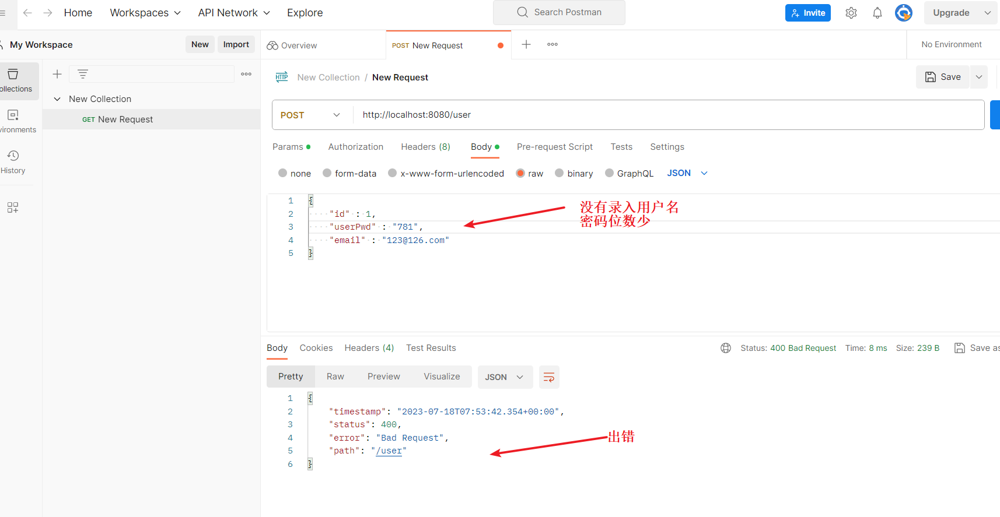

后台警告信息：


## Spring Boot中Bean管理

之前在异常处理中我们使用了利用配置类来完成全局异常处理的方式：

```java
@Configuration
public class GlobalExceptionHandler2 {
    @Bean
    public SimpleMappingExceptionResolver getSME(){
        SimpleMappingExceptionResolver sme = new SimpleMappingExceptionResolver();
        Properties p = new Properties();
        p.put("java.lang.ArithmeticException","myerror");
        sme.setExceptionMappings(p);
        return sme;
    }
}
```

利用@Configuration、@Bean注解来完成。因为Spring Boot 中没有XML文件，所以所有的Bean管理都放入在一个配置类中实现。
配置类就是类上具有@Configuration的类。这个类就相当于之前的applicationContext.xml。

现在我们就重点讲一下这个bean管理，通过案例来感受，我们构建一个Student类，然后构建Student类对象：

**在com.msb.pojo下构建Student类：**

```java
package com.msb.pojo;

/**
 * @Author: zhaoss
 */
public class Student {
    private int id;
    private String name;

    public int getId() {
        return id;
    }

    public void setId(int id) {
        this.id = id;
    }

    public String getName() {
        return name;
    }

    public void setName(String name) {
        this.name = name;
    }

    public Student(int id, String name) {
        this.id = id;
        this.name = name;
    }

    public Student() {
    }
    
    @Override
    public String toString() {
        return "Student{" +
                "id=" + id +
                ", name='" + name + '\'' +
                '}';
    }
}

```

之前构建对象可以怎么做呢？可以在Student类中加入@Component注解即可，或者使用配置文件 applicationContext.xml：

```xml
<?xml version="1.0" encoding="UTF-8"?>
<beans xmlns="http://www.springframework.org/schema/beans"
       xmlns:xsi="http://www.w3.org/2001/XMLSchema-instance"
       xsi:schemaLocation="http://www.springframework.org/schema/beans
        https://www.springframework.org/schema/beans/spring-beans.xsd">

    <bean id="s" class="com.msb.pojo.Student">
    	<property name="id" value="1"></property>
        <property name="name" value="zs"></property>
    </bean>

</beans>
```

但是Spring Boot 中没有XML文件，所以所有的Bean管理都放入在一个配置类中实现：

**创建包com.msb.config，在下面定义配置类：MyConfig:**

```java
package com.msb.config;

import com.msb.pojo.Student;
import org.springframework.context.annotation.Bean;
import org.springframework.context.annotation.Configuration;

/**
 * @Author: zhaoss
 */
@Configuration  // 加入这个注解，代表当前为配置类，可以替代xml
public class MyConfig {
    // 相当于以前的bean标签,s相当于以前的id
    // 如果括号中s没有写，那么id相当于方法名：getStudent
    @Bean("s")
    public Student getStudent(){
        Student s = new Student();
        s.setId(1);
        s.setName("zs");  //这个过程就相当于之前给对象注入属性的过程
        return s;
    }

}

```

利用单元测试，测试s对象：

```java
package com.msb;

import com.msb.pojo.Student;
import org.junit.jupiter.api.Test;
import org.springframework.beans.factory.annotation.Autowired;
import org.springframework.boot.test.context.SpringBootTest;

@SpringBootTest
class SpringBootM10ApplicationTests {
    /*
     将对象注入
     先按照类型注入，如果该类型对象有多个再按照名字
     */
    @Autowired
    private Student stu;

    @Test
    void contextLoads() {
        System.out.println(stu);
    }

}

```

结果：


我们用这种方式，一般都是创建Spring框架封装的对象，如异常案例中的：SimpleMappingExceptionResolver。

@Autowired的注入：先按照类型注入，如果该类型对象有多个再按照名字**，那么问题来了，如果真的有多个类型相同的对象呢？**

比如：

```java
package com.msb.config;

import com.msb.pojo.Student;
import org.springframework.context.annotation.Bean;
import org.springframework.context.annotation.Configuration;

/**
 * @Author: zhaoss
 */
@Configuration 
public class MyConfig {
    @Bean("s")
    public Student getStudent(){
        Student s = new Student();
        s.setId(1);
        s.setName("zs");  
        return s;
    }

    @Bean("s2")
    public Student getStudent2(){
        Student s = new Student();
        s.setId(2);
        s.setName("ls");  
        return s;
    }

}

```

那么测试类中如何写呢？

```java
package com.msb;

import com.msb.pojo.Student;
import org.junit.jupiter.api.Test;
import org.springframework.beans.factory.annotation.Autowired;
import org.springframework.beans.factory.annotation.Qualifier;
import org.springframework.boot.test.context.SpringBootTest;

@SpringBootTest
class SpringBootM10ApplicationTests {
    @Autowired
    @Qualifier("s2")  // Spring容器中存在同类型的Bean通过Bean的名称获取到Bean对象,需要@Autowired、@Qualifier结合使用
    private Student stu;

    @Test
    void contextLoads() {
        System.out.println(stu);
    }
}

```

测试结果：


再加深难度，如果现在有**学生类，班级类**：

班级类：

```java
package com.msb.pojo;

/**
 * @Author: zhaoss
 */
public class Clazz {
    private int id;
    private String name;

    public int getId() {
        return id;
    }

    public void setId(int id) {
        this.id = id;
    }

    public String getName() {
        return name;
    }

    public void setName(String name) {
        this.name = name;
    }

    public Clazz() {
    }

    public Clazz(int id, String name) {
        this.id = id;
        this.name = name;
    }

    @Override
    public String toString() {
        return "Clazz{" +
                "id=" + id +
                ", name='" + name + '\'' +
                '}';
    }
}

```


学生类：

```java
package com.msb.pojo;

/**
 * @Author: zhaoss
 */
public class Student {
    private int id;
    private String name;
    private Clazz c;

    public int getId() {
        return id;
    }

    public void setId(int id) {
        this.id = id;
    }

    public String getName() {
        return name;
    }

    public void setName(String name) {
        this.name = name;
    }

    public Clazz getC() {
        return c;
    }

    public void setC(Clazz c) {
        this.c = c;
    }

    public Student(int id, String name, Clazz c) {
        this.id = id;
        this.name = name;
        this.c = c;
    }

    public Student() {
    }

    @Override
    public String toString() {
        return "Student{" +
                "id=" + id +
                ", name='" + name + '\'' +
                ", c=" + c +
                '}';
    }
}

```

现在就需要创建学生对象的同时，指定学生所在的班级，所以需要构建班级对象，然后注入给学生：

配置类：

```java
package com.msb.config;

import com.msb.pojo.Clazz;
import com.msb.pojo.Student;
import org.springframework.context.annotation.Bean;
import org.springframework.context.annotation.Configuration;

/**
 * @Author: zhaoss
 */
@Configuration  
public class MyConfig {

    @Bean("s2")
    public Student getStudent2(Clazz c){// 在参数中加入Clazz c,通过参数传递的形式完成注入，会优先找容器中同类型的Clazz对象，如果多个Clazz对象，可以使用：(@Qualifier("cla") Clazz c),这个位置不需要使用@AutoWire注解，因为在这里默认就是利用参数注入对象
        Student s = new Student();
        s.setId(2);
        s.setName("ls");  
        //s.setC(getCla());// 这种调用方法的形式也可以，但不是注入的形式
        s.setC(c);
        return s;
    }

    @Bean("cla")
    public Clazz getCla(){
        Clazz c = new Clazz();
        c.setId(1);
        c.setName("java406班");
        return c;
    }
    
    @Bean("cla2")
    public Clazz getCla(){
        Clazz c = new Clazz();
        c.setId(1001);
        c.setName("java班级");
        return c;
    }

}

```

测试类：

```java
package com.msb;

import com.msb.pojo.Student;
import org.junit.jupiter.api.Test;
import org.springframework.beans.factory.annotation.Autowired;
import org.springframework.beans.factory.annotation.Qualifier;
import org.springframework.boot.test.context.SpringBootTest;

@SpringBootTest
class SpringBootM10ApplicationTests {
    @Autowired
    @Qualifier("s2") 
    private Student stu;

    @Test
    void contextLoads() {
        System.out.println(stu);
    }

}

```

结果：

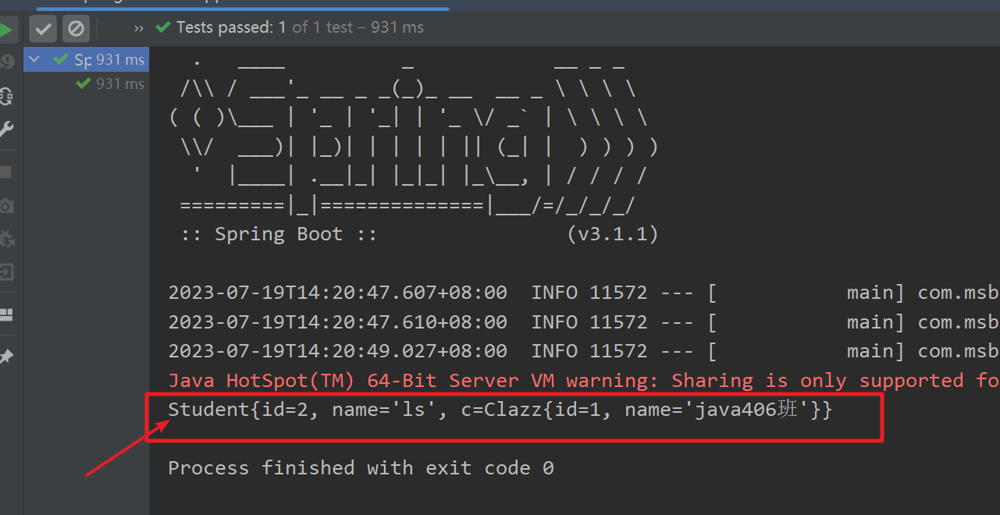

所以以后你可能会在**配置类的方法**中见到很多参数，你没有传递，但是这个参数就有值了，那一定是因为SpringBoot底层已经帮你把各种对象创建好了，帮你注入了，你拿着这个参数直接使用即可。（这种注入只在配置类中有效，在别处不可以通过参数注入对象）

## SpringBoot中拦截器的使用

### 整合拦截器

在学习SpringMVC的时候我们就学习过拦截器的配置，（如果不记得自己翻一下笔记），定义拦截器，在springmvc.xml中对拦截器进行配置。那么现在在SpringBoot项目中如何配置拦截器呢?

首先定义拦截器，这个与SpringMVC中的学习是一致的，在com.msb.interceptors中定义拦截器：

注意需要加入@Component注解，代表使用容器管理拦截器对象

```java
@Component
public class DemoInterceptor implements HandlerInterceptor {
    @Override
    public boolean preHandle(HttpServletRequest request, HttpServletResponse response, Object handler) throws Exception {
        System.out.println("执行拦截器");
        return true;
    }
    
    // 省略postHandle、afterCompletion方法，与springmvc中定义一致
}

```

定义好拦截器以后，配置拦截器，在springmvc中是利用xml对拦截器配置进行注册，但是springboot中没有xml配置，怎么处理呢？使用配置类：

```java
@Configuration  // 类上有注解@Configuration,此类相当于SpringMVC配置文件。
public class MyConfig implements WebMvcConfigurer {
    @Autowired
    private DemoInterceptor demoInterceptor;
    //配置拦截器的映射
    @Override
    public void addInterceptors(InterceptorRegistry registry) {

        /*InterceptorRegistration ir = registry.addInterceptor(demoInterceptor);
        InterceptorRegistration ir2 = ir.addPathPatterns("/**");  // 设置拦截路径
        InterceptorRegistration ir3 = ir2.excludePathPatterns("/login"); // 设置不拦截url*/
        // 链式调用
        registry.addInterceptor(demoInterceptor).addPathPatterns("/**").excludePathPatterns("/login");
    }
}
```

registry.addInterceptor(demoInterceptor) —— 代表注册拦截器

addPathPattern() —— 设置拦截路径，拦截哪些URL，/** 拦截全部

excludePathPatterns() —— 不拦截哪些URL


PS：当excludePathPatterns()和addPathPattern()冲突时，excludePathPatterns()生效。

如下：registry.addInterceptor(demoInterceptor).addPathPatterns("/login").excludePathPatterns("/login");


### 拦截器应用案例

创建项目：


目录结构整体最终结果：


**案例：非登录状态下无法访问静态资源。**

创建登录页面login.html:

```html
<!DOCTYPE html>
<html lang="en">
<head>
    <meta charset="UTF-8">
    <title>Title</title>
</head>
<body>
    <form action="login">
        <input type="text" name="uname">
        <input type="password" name="pwd">
        <input type="submit" value="登录">
    </form>
</body>
</html>
```

点击登录按钮，跳转到login控制单元： com.msb.controller.MyController:

```java
package com.msb.controller;

import jakarta.servlet.http.HttpServletRequest;
import org.springframework.stereotype.Component;
import org.springframework.stereotype.Controller;
import org.springframework.web.bind.annotation.RequestMapping;

/**
 * @Author: zhaoss
 */
@Controller
public class LoginController {
    @RequestMapping("/login")
    public String login(String uname, String pwd, HttpServletRequest req){
        System.out.println("---" + uname + "---" + pwd);
        if ("lili".equals(uname) && "123123".equals(pwd)){
            // 登录成功在session作用域中存入数据：
            req.getSession().setAttribute("uname",uname);
            // 登录成功跳转到主页面：
            return "main";
        }
       return "redirect:/login.html";
    }
}

```

登录成功，跳转如main.html中：resources/templates/main.html:

```html
<!DOCTYPE html>
<html lang="en">
<head>
    <meta charset="UTF-8">
    <title>Title</title>
</head>
<body>
这是主页
</body>
</html>
```


启动服务器，测试，发现 ：http://localhost:8080/a.html 、  http://localhost:8080/login.html都可以直接访问，对于a.html来说，应该是登录后才可以访问，怎么处理呢？使用拦截器：

加入拦截器类：com.msb.interceptors.LoginInterceptor:

```java
package com.msb.interceptors;

import jakarta.servlet.http.HttpServletRequest;
import jakarta.servlet.http.HttpServletResponse;
import org.springframework.stereotype.Component;
import org.springframework.web.servlet.HandlerInterceptor;

/**
 * @Author: zhaoss
 */
@Component
public class LoginInterceptor implements HandlerInterceptor {
    @Override
    public boolean preHandle(HttpServletRequest request, HttpServletResponse response, Object handler) throws Exception {
        // 如果登录过，就放行：
        if (request.getSession().getAttribute("uname") != null){
            return true;
        }
        // 如果没有登录过，先进行登录：(重定向)
        response.sendRedirect("login.html");
        return false; // 不放行
    }
}

```

注册拦截器：com.msb.config.MyConfig:

```java
package com.msb.config;

import com.msb.interceptors.LoginInterceptor;
import org.springframework.beans.factory.annotation.Autowired;
import org.springframework.context.annotation.Configuration;
import org.springframework.web.servlet.config.annotation.InterceptorRegistry;
import org.springframework.web.servlet.config.annotation.WebMvcConfigurer;

/**
 * @Author: zhaoss
 */
@Configuration
public class MyConfig implements WebMvcConfigurer {
    @Autowired
    private LoginInterceptor loginInterceptor;
    //配置拦截器的映射
    @Override
    public void addInterceptors(InterceptorRegistry registry) {
        // 拦截所有路径
        // 但是对：login.html放行，向后台提交login的时候放行。
        registry.addInterceptor(loginInterceptor).addPathPatterns("/**").excludePathPatterns("/login","/login.html");//链式调用
    }
}

```

测试：在没有登录的情况下直接访问：http://localhost:8080/a.html 不可以，会直接跳转到：  http://localhost:8080/login.html。案例成功。


但是新的问题又出现了，如果在login.html中有其他的静态资源：

```html
<!DOCTYPE html>
<html lang="en">
<head>
    <meta charset="UTF-8">
    <title>Title</title>
</head>
<body>
    <form action="login">
        <input type="text" name="uname">
        <input type="password" name="pwd">
        <input type="submit" value="登录">
    </form>


</body>
</html>
```

目录结构为：


那么访问login.html的时候：

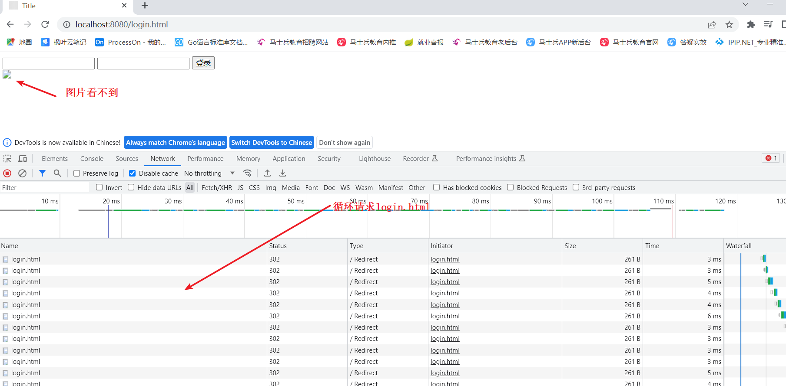

因为你请求login.html,login.html中有a.png这个静态资源，拦截器中处理的是这个静态资源拦截会又跳转到login.html，进入login.html中又会请求a.png.....反复......

那怎么处理呢？在没登录的情况下，图片资源、js资源、css资源应该放行，所以在拦截器中加入静态资源的放行：

```java
package com.msb.config;

import com.msb.interceptors.LoginInterceptor;
import org.springframework.beans.factory.annotation.Autowired;
import org.springframework.context.annotation.Configuration;
import org.springframework.web.servlet.config.annotation.InterceptorRegistry;
import org.springframework.web.servlet.config.annotation.WebMvcConfigurer;

/**
 * @Author: zhaoss
 */
@Configuration
public class MyConfig implements WebMvcConfigurer {
    @Autowired
    private LoginInterceptor loginInterceptor;
    //配置拦截器的映射
    @Override
    public void addInterceptors(InterceptorRegistry registry) {
        // 拦截所有路径
        // 但是对：login.html放行，向后台提交login的时候放行。
        registry.addInterceptor(loginInterceptor).addPathPatterns("/**").excludePathPatterns("/login","/login.html","/css/**","/js/**","/images/**");//链式调用
    }
}

```

测试：


## SpringBoot项目 - favicon

一般favicon图标都是前端进行设置，当然后端也可以完成：


```java
package com.msb.controller;

import com.msb.pojo.User;
import jakarta.validation.Valid;
import org.springframework.web.bind.annotation.*;

/**
 * @Author: zhaoss
 */
@RestController
public class MyController {
    @GetMapping("/test")
    public void test(){
        System.out.println("test");
    }
}

```


启动服务器，访问控制单元：

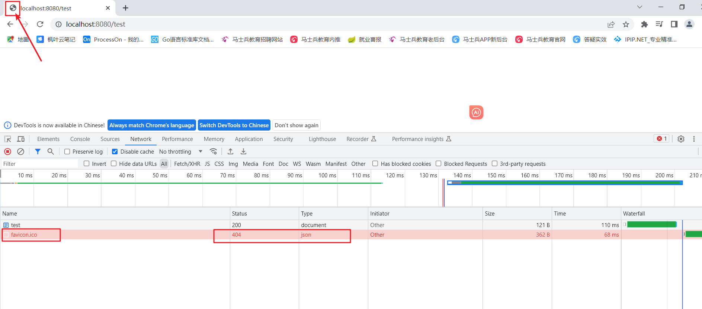


发现该网站并没有图标，因为在访问的时候会去项目中找favicon.ico图标，解决办法：

（1）在application.yml中禁用springboot默认图标：

```yml
spring:
    favicon:
      enabled: false
```

（2）在项目中加入静态资源：


重启服务器，访问：

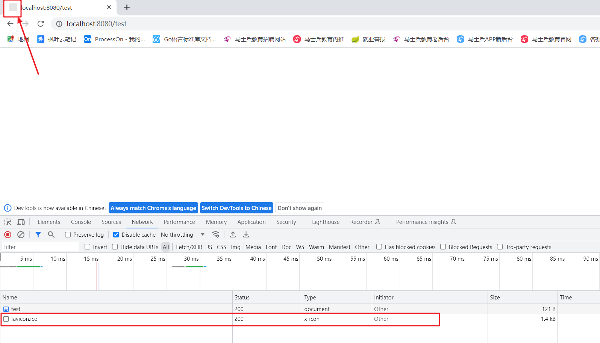

如果不好使，就先clean项目再重启服务器（静态资源修改有时候不生效，最好clean一下），浏览器访问前先ctrl+f5清空缓存。

## SpringBoot整合MyBatis-plus

MyBatis-plus框架虽然没有进行独立学习，但是学习起来非常简单，我们可以直接讲解。

### MyBatis-plus简介

官网：https://mp.baomidou.com/ 


点击快速开始，可以使用MyBatis-Plus文档。

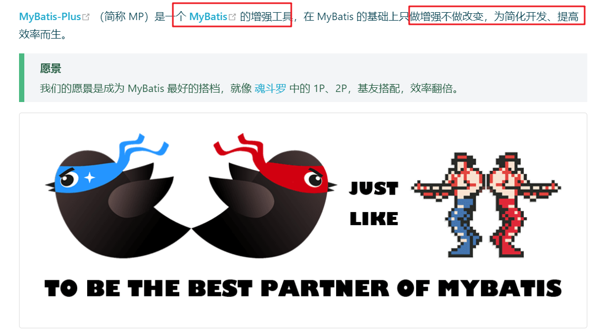

### 入门案例

#### **创建项目、添加依赖**

```xml
        <!--web启动器-->
        <dependency>
            <groupId>org.springframework.boot</groupId>
            <artifactId>spring-boot-starter-web</artifactId>
        </dependency>
        <!--mysql驱动依赖-->
        <dependency>
            <groupId>com.mysql</groupId>
            <artifactId>mysql-connector-j</artifactId>
            <scope>runtime</scope>
        </dependency>
        <!--lombok依赖-->
        <dependency>
            <groupId>org.projectlombok</groupId>
            <artifactId>lombok</artifactId>
            <optional>true</optional>
        </dependency>
        <!--mybatis-plus启动器-->
        <dependency>
            <groupId>com.baomidou</groupId>
            <artifactId>mybatis-plus-boot-starter</artifactId>
            <version>3.5.3.1</version>
        </dependency>
        <!-- 添加druid启动器-->
        <dependency>
            <groupId>com.alibaba</groupId>
            <artifactId>druid-spring-boot-starter</artifactId>
            <version>1.2.11</version>
        </dependency>

        <!--单元测试依赖-->
        <dependency>
            <groupId>org.springframework.boot</groupId>
            <artifactId>spring-boot-starter-test</artifactId>
            <scope>test</scope>
        </dependency>
```

#### 配置信息

在application.yml中配置数据源、实体类别名、扫描xml位置

配置方式与之前整合mybatis一致，因为mybatis-plus的原则是:只增强不改变

```yml
spring:
  datasource:
    type: com.alibaba.druid.pool.DruidDataSource  #底层使用druid连接池
    driver-class-name: com.mysql.cj.jdbc.Driver
    url: jdbc:mysql://localhost:3306/msbsys?serverTimezone=Asia/Shanghai&useSSL=false&characterEncoding=utf8
    username: root
    password: root
    druid:
      # 连接池的配置信息
      initial-size: 5  # 初始化连接数大小
      max-active: 30  # 最大连接数
      min-idle: 5   # 最小连接数

      # 配置获取连接等待超时的时间
      max-wait: 60000  #如果连接都被占用，最大等待时间1min=60000ms
      validation-query: SELECT 1 FROM DUAL  #通过从续表查询来监控是否连接数据库，语句执行能连接，语句不执行没连接
      # 配置一个连接在池中最小空闲的时间，单位是毫秒
      min-evictable-idle-time-millis: 300000
      test-while-idle: true
      # 开启SQL监控、防火墙监控、日志监控
      filters: stat,wall,slf4j
      # 配置DruidStatViewServlet
      stat-view-servlet:
        # 登录名
        login-username: admin
        # 登录密码
        login-password: admin
        url-pattern: /druid/*
        # IP白名单(没有配置或者为空，则允许所有访问)
        allow: 192.167.10.1,127.0.0.1  # 本机和设置的ip可以访问后台管理界面
        reset-enable: false # 不要重置
        # 启用控制台-后台管理界面，必须启用，否则访问界面会404
        enabled: true


mybatis:
  #起别名
  type-aliases-package: com.msb.pojo
  #扫描mybatis下所有的xml文件  ---》使用mybatis-plus后可以不使用mapper.xml文件了 ，所以这步可以取消
 # mapper-locations: classpath:mapper/*.xml
```

#### 构建实体类

com.msb.pojo.User:

```java
package com.msb.pojo;

import com.baomidou.mybatisplus.annotation.TableField;
import com.baomidou.mybatisplus.annotation.TableName;
import lombok.AllArgsConstructor;
import lombok.Data;
import lombok.NoArgsConstructor;

/**
 * @Author: zhaoss
 */
@NoArgsConstructor
@AllArgsConstructor
@Data
@TableName("t_user")  // 对应的数据库中表为t_user,如果数据库中表和实体类名字一致，可以不指定
public class User {

    @TableField(exist = false) // 如果数据库表中没有这个字段，这个字段与数据库表字段对不上，加了这个属性，就不会报错
    private Integer a;

    @TableField("uid") // 指定数据库表中字段名字，如果数据库表字段和属性名字一致，可以不指定
    private Integer id;

    private String uname;

    private String pwd;

    private String realname;

    private Integer identity;
}

```

#### 构建mapper层

mapper接口：

```java
package com.msb.mapper;

import com.baomidou.mybatisplus.core.mapper.BaseMapper;
import com.msb.pojo.User;

/**
 * @Author: zhaoss
 * 继承BaseMapper接口，该接口中定义了很多基础的增删改查的方法，
 * 所以UserMapper中就不需要定义基础的增删改查方法了
 */
public interface UserMapper extends BaseMapper<User> {

}

```

mapper.xml可以不写了


#### 构建service层

service接口：

```java
package com.msb.service;

import com.baomidou.mybatisplus.extension.service.IService;
import com.msb.pojo.User;

/**
 * @Author: zhaoss
 * 继承IService接口，该接口中定义了很多基础的增删改查的方法，
 *  * 所以UserService中就不需要定义基础的增删改查方法了
 */
public interface UserService extends IService<User> {
}

```

service实现类：

```java
package com.msb.service.impl;

import com.baomidou.mybatisplus.extension.service.impl.ServiceImpl;
import com.msb.mapper.UserMapper;
import com.msb.pojo.User;
import com.msb.service.UserService;
import org.springframework.stereotype.Service;

/**
 * @Author: zhaoss
 * 如果用UserServiceImpl  直接implements UserService会报错
 * 因为要实现全部的抽象方法
 * 那还不如不继承了，太麻烦了呀
 * mybatis-plus同样给出了解决方案，让UserServiceImpl继承ServiceImpl
 * ServiceImpl有两个泛型，其中一个代表你要注入的mapper，另一个代表你这个实现类中操作的那个表对应的实体类
 * 这样UserServiceImpl中一些基本的方法就不用去写了，除非一些特殊的逻辑底层没提供那你就自己加入
 */
@Service
public class UserServiceImpl extends ServiceImpl<UserMapper, User> implements UserService {

}

```

#### 启动类

启动类加入mapper层扫描：

```java
package com.msb;

import org.mybatis.spring.annotation.MapperScan;
import org.springframework.boot.SpringApplication;
import org.springframework.boot.autoconfigure.SpringBootApplication;

@SpringBootApplication
@MapperScan("com.msb.mapper")  // 加入mapper层的扫描
public class SpringBootM12Application {

    public static void main(String[] args) {
        SpringApplication.run(SpringBootM12Application.class, args);
    }

}

```

#### 测试

利用单元测试进行测试

```java
package com.msb;

import com.msb.pojo.User;
import com.msb.service.UserService;
import org.junit.jupiter.api.Test;
import org.mybatis.spring.annotation.MapperScan;
import org.springframework.beans.factory.annotation.Autowired;
import org.springframework.boot.test.context.SpringBootTest;

import java.util.List;

@SpringBootTest

class SpringBootM12ApplicationTests {

    @Autowired
    private UserService userService;
    @Test
    void contextLoads() {
        // 查询全部USer：
        List<User> list = userService.list();
        for (User user : list) {
            System.out.println(user);
        }
    }


}

```


#### 测试增删改查

```java
package com.msb;

import com.baomidou.mybatisplus.core.conditions.query.QueryWrapper;
import com.msb.pojo.User;
import com.msb.service.UserService;
import org.junit.jupiter.api.Test;
import org.mybatis.spring.annotation.MapperScan;
import org.springframework.beans.factory.annotation.Autowired;
import org.springframework.boot.test.context.SpringBootTest;

import java.util.List;

@SpringBootTest

class SpringBootM12ApplicationTests {

    @Autowired
    private UserService userService;
    @Test
    void test01() {
        // 查询全部USer：
        List<User> list = userService.list();
        for (User user : list) {
            System.out.println(user);
        }
    }

    @Test
    void test02() {
        // 带条件的查询：
        // 查询uid>=5的数据
        // QueryWrapper 作用就是在原本的sql上拼接where条件
        // 适用场合：查询、删除、更新
        QueryWrapper<User> q = new QueryWrapper<>();
        q.ge("uid",5);// 条件指定参照使用手册

        List<User> list = userService.list(q); // 将条件传入
        for (User user : list) {
            System.out.println(user);
        }

    }

    @Test
    void test03() {
        // 带条件的查询：
        // 查询uid>=5，uname=fh的数据
        QueryWrapper<User> q = new QueryWrapper<>();
        q.ge("uid", 5).eq("uname","fh");// 多条件追加调用即可

        List<User> list = userService.list(q); // 将条件传入
        for (User user : list) {
            System.out.println(user);
        }

    }

    @Test
    void test04() {
        // 查询单个数据：
        QueryWrapper<User> q = new QueryWrapper<>();
        q.eq("uname","fh");

        User one = userService.getOne(q);
        System.out.println(one);


    }

    @Test
    void test05() {
        // 增加数据：单个增加用save方法，多个用saveBatch方法
        boolean save = userService.save(new User(1, 111, "a", "a", "a", 1));
        System.out.println(save);
    }

    @Test
    void test06() {
        // 更新数据：
        QueryWrapper<User> q = new QueryWrapper<>();
        q.eq("uid","111");
        User u = new User(1, 111, "bbb", "bbb", "bb", 2);
        boolean update = userService.update(u, q);//第一个参数为更新的字段，第二个参数为更新的where条件
        System.out.println(update);


    }

    @Test
    void test07() {
        // 删除数据：
        QueryWrapper<User> q = new QueryWrapper<>();
        q.eq("uid","111");
        boolean remove = userService.remove(q);//第一个参数为更新的字段，第二个参数为更新的where条件
        System.out.println(remove);
    }
}

```

从上看到，其实controller层的写法还是比较麻烦的，所以并不是所有的框架都使用mybatis-plus。你自行考虑是否选择即可。

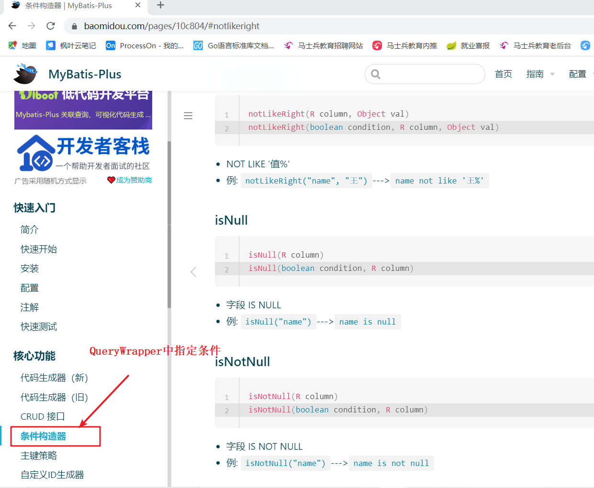

#### 分页操作

mybatis-plus自带分页插件，不用像之前一样整合PageHelper了。

（1）想要分页插件生效，先进行配置分页插件，配置分页拦截器：


可以修改为如下，可修改、也可以不修改

```java
package com.msb.config;

import com.baomidou.mybatisplus.annotation.DbType;
import com.baomidou.mybatisplus.extension.plugins.MybatisPlusInterceptor;
import com.baomidou.mybatisplus.extension.plugins.inner.PaginationInnerInterceptor;
import org.springframework.context.annotation.Bean;
import org.springframework.context.annotation.Configuration;

/**
 * @Author: zhaoss
 */
@Configuration
public class PageConfig {
    /**
     * 新的分页插件,一缓和二缓遵循mybatis的规则,需要设置 MybatisConfiguration#useDeprecatedExecutor = false 避免缓存出现问题(该属性会在旧插件移除后一同移除)
     */
    @Bean
    public MybatisPlusInterceptor mybatisPlusInterceptor() {
        MybatisPlusInterceptor interceptor = new MybatisPlusInterceptor();
        PaginationInnerInterceptor p = new PaginationInnerInterceptor();
        p.setOverflow(false);// 设置是否轮回，就是查到最后一条的时候是否需要轮回到第一条
        p.setMaxLimit(500L);// 单页最大数量500
        p.setDbType(DbType.MYSQL);// 设置数据库类型
        interceptor.addInnerInterceptor(p);
        return interceptor;
    }
}

```


（2）测试方法中：

```java
package com.msb;

import com.baomidou.mybatisplus.core.conditions.query.QueryWrapper;
import com.baomidou.mybatisplus.extension.plugins.pagination.Page;
import com.msb.pojo.User;
import com.msb.service.UserService;
import org.junit.jupiter.api.Test;
import org.mybatis.spring.annotation.MapperScan;
import org.springframework.beans.factory.annotation.Autowired;
import org.springframework.boot.test.context.SpringBootTest;

import java.util.List;

@SpringBootTest

class SpringBootM12ApplicationTests {

    @Autowired
    private UserService userService;


    @Test
    public void testPage(){
        // 分页查询条件：当前页  页大小
        // 带条件的分页加上QueryWrapper
        QueryWrapper<User> queryWrapper=new QueryWrapper<>();
        queryWrapper.lt("uid", "5");
        Page<User> page = userService.page(new Page<>(1, 3), queryWrapper);
        // 分页返回数据：当前页数据  总页数  总记录数  当前页  页大小 ... ..
        List<User> list = page.getRecords();
        list.forEach(System.out::println);
        System.out.println("总页数:"+page.getPages());
        System.out.println("总记录数:"+page.getTotal());
        System.out.println("当前页:"+page.getCurrent());
        System.out.println("页大小:"+page.getSize());
    }


}

```


结果：


## 扩展-SpringBoot底层原理

之前对于SpringBoot的学习，就是停留在应用阶段，那么SpringBoot底层原理是什么样子呢？一起来揭晓。

之前我们就学习过Spring Boot的核心，你从之前的应用阶段也感受到了：

​		**起步依赖**- 即启动器，起步依赖本质上是一个Maven项目对象模型（Project Object Model，POM），定义了对其他库的传递依赖，这些东西加在一起即支持某项功能。 简单的说，起步依赖就是将具备某种功能的坐标打包到一起，并提供一些默认的功能。

​		**自动配置** -Spring Boot的自动配置是一个运行时（更准确地说，是应用程序启动时）的过程，考虑了众多因素，才决定 Spring配置应该用哪个，不该用哪个。该过程是Spring自动完成的。  

所以起步依赖和自动配置就是我们要研究的两个方向。

### 依赖机制管理

先进行思考：

#### （1）为什么我们进行web开发，导入web启动器后，所有相关的依赖都导入进来了？

web启动器：

```xml
<dependency>
    <groupId>org.springframework.boot</groupId>
    <artifactId>spring-boot-starter-web</artifactId>
</dependency>
```

对应依赖：


答案：

点入<artifactId>spring-boot-starter-web</artifactId>，发现其中有个<dependencies>标签，内部导入了非常多的依赖，这些依赖中有的也是启动器，有的是依赖jar包。依赖的启动器又依赖了很多jar包。

所以只要导入一个场景启动器，这个场景启动器会自动的把它用到的所有的功能场景相关的依赖全部导入。按照maven的依赖传递原则，A依赖B，B依赖C，那么A就依赖了B和C。这样以后的开发会变得非常简单，你想做什么场景，就导入什么场景启动器就可以了。


#### （2）为什么在导入依赖的时候，版本号不用写？

比如：

```xml
        <dependency>
            <groupId>org.springframework.boot</groupId>
            <artifactId>spring-boot-starter-web</artifactId>
        </dependency>

        <dependency>
            <groupId>org.springframework.boot</groupId>
            <artifactId>spring-boot-starter-test</artifactId>
            <scope>test</scope>
        </dependency>
```

答案：

因为我们的springboot项目，都有一个父项目spring-boot-starter-parent：

```xml
   <parent>
        <groupId>org.springframework.boot</groupId>
        <artifactId>spring-boot-starter-parent</artifactId>
        <version>3.1.2</version>
        <relativePath/> <!-- lookup parent from repository -->
    </parent>
```

点击进入：<artifactId>spring-boot-starter-parent</artifactId>发现这个父项目还有父项目spring-boot-dependencies：

```xml
  <parent>
    <groupId>org.springframework.boot</groupId>
    <artifactId>spring-boot-dependencies</artifactId>
    <version>3.1.2</version>
  </parent>
```

点击进入：<artifactId>spring-boot-dependencies</artifactId>发现其中有个标签<properties>，内部可以看到很多技术对应的版本信息，这些技术的版本信息已经内置规定好了，这些版本信息都是精挑细选的，如果将来某一天你用到这些技术，这些版本之间是一定不会造成冲突的，相当于springboot在定义3.1.2版本的时候把其他大部分技术对应的版本都定义好了，都是经过测试的，我们使用的时候放心大胆的去用就行了，如果人家没有给我们规定好，让我们自己去选择版本的话，很可能就造成冲突了。

往下看还有<dependencyManagement>标签，叫做版本锁定/依赖管理，一般在父工程中定义一些版本的信息，这样子工程继承父工程的时候，就无需指定版本信息了，比如后续我们在项目中要是引入spring-boot-starter-web就无需指定版本信息了，因为已经内置好了：（下面图片摘自源码）


换句话说就是版本号其实已经在父项目中进行管理了！父项目可以称为版本仲裁中心。

但是如果你觉得父项目中给你提供的版本不好用，你想用自己指定版本的依赖，那么就利用maven的就近原则，在pom.xml中指定自己的版本即可。比如我想修改mysql驱动的依赖，父项目中提供的版本号为：


可以在你自己项目的pom.xml中直接指定你需要的版本即可：

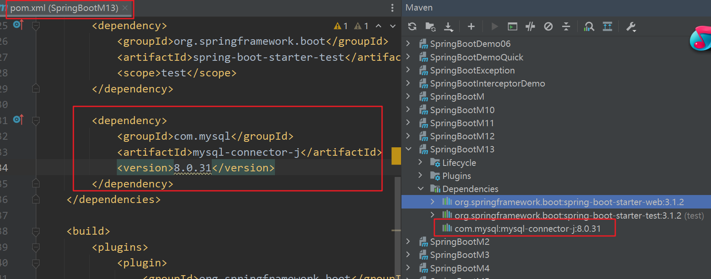


如果是第三方的jar包，父项目没有进行管理的，那么版本号就需要自行声明，比如我们用过的druid连接池的依赖：（坐标自己去maven仓库中找）

```xml
<!-- 添加druid启动器-->
<dependency>
    <groupId>com.alibaba</groupId>
    <artifactId>druid-spring-boot-starter</artifactId>
    <version>1.2.11</version>
</dependency>
```

### 自动配置机制

SpringBoot自动配置完成流程是什么样子的呢？

**（一）创建项目，导入启动器。比如导入web启动器：**

```xml
<dependency>
    <groupId>org.springframework.boot</groupId>
    <artifactId>spring-boot-starter-web</artifactId>
</dependency>
```

1. 场景启动器帮我们导入了相关场景的所有依赖，比如：spring-boot-starter-json、spring-boot-starter-tomcat、spring-web、spring-webmvc。

2. 除了上面的依赖之外，还导入了一个spring-boot-starter，你会发现所有的启动器都导入了spring-boot-starter，这个spring-boot-starter是核心启动器，是启动器的启动器。

3. 点入spring-boot-starter，发现其中有一个依赖spring-boot-autoconfigure，自动配置的包。这个包你可以看一下：springboot把各种场景的功能对应的自动配置都放在这里了（比如整合web的配置，整合thymeleaf的配置、整合es的配置、整合redis的配置等等全都在里面），里面囊括了所有场景的所有配置。

   


4. 只要spring-boot-autoconfigure包下的所有类都能生效，那么相当于springboot的官方写好的整合功能就生效。
5. 但是SpringBoot默认扫描不到spring-boot-autoconfigure包下写好的配置类，SpringBoot默认只扫描主程序所在的包和子包中的注解。启动类在启动时会**做注解扫描**(@Controller、@Service、@Repository......)，扫描位置为同包或者子包下的注解。

------》截止到这里，相当于spring-boot-autoconfigure包下所有自动配置类引入项目中了，至于是否生效，要看下面第（二）步。

**（二）创建主程序，主程序上使用@SpringBootApplication注解**

主程序中有一个@SpringBootApplication注解，点入@SpringBootApplication注解发现，该注解上面还有三个非常重要的注解：

```
@Configuration（@SpringBootConfiguration点开查看发现里面还是应用了@Configuration）
@EnableAutoConfiguration
@ComponentScan
```

​	即 @SpringBootApplication = (默认属性)@Configuration + @EnableAutoConfiguration + @ComponentScan。

​	所以，如果我们使用如下的SpringBoot启动类，整个SpringBoot应用依然可以与之前的启动类功能对等：

```
@Configuration
@EnableAutoConfiguration
@ComponentScan
public class Application {// 启动类
    public static void main(String[] args) {
        SpringApplication.run(Application.class, args);
    }
}
```

这些注解的作用是什么呢？

1. @SpringBootConfiguration点进去发现该注解上有个@Configuration注解，所以就相当于主程序是一个Spring Ioc容器的配置类

2. @ComponentScan的功能其实就是自动扫描并加载符合条件的组件（比如@Component和@Repository等）或者bean定义，最终将这些bean定义加载到IoC容器中。我们可以通过@ComponentScan的basePackages等属性来细粒度的定制@ComponentScan自动扫描的范围，如果不指定，则默认Spring框架实现会从声明@ComponentScan所在类的package进行扫描。这也是为什么我们的启动类一般放在com.msb下，因为会从com.msb及其子包扫描。
3. @EnableAutoConfiguration：该注解是开启springboot自动配置的核心。如何开启的自动配置呢？

点入EnableAutoConfiguration注解，发现上面还有一个注解Import：

```java
@Import({AutoConfigurationImportSelector.class})
public @interface EnableAutoConfiguration {
    ...
}
```

@Import注解的作用是：给容器中放入指定类型的组件。AutoConfigurationImportSelector这个类比较特殊，可以实现批量导入组件，这个类中有个方法：该方法可以获取自动配置的集合，看看都可以帮我们批量导入哪些组件。


```java
protected List<String> getCandidateConfigurations(AnnotationMetadata metadata, AnnotationAttributes attributes) {
        List<String> configurations = ImportCandidates.load(AutoConfiguration.class, this.getBeanClassLoader()).getCandidates();
        Assert.notEmpty(configurations, "No auto configuration classes found in META-INF/spring/org.springframework.boot.autoconfigure.AutoConfiguration.imports. If you are using a custom packaging, make sure that file is correct.");
        return configurations;
    }
```


getCandidateConfigurations这个方法就是获取候选的配置，这些配置是从哪里来的呢？从：META-INF/spring/org.springframework.boot.autoconfigure.AutoConfiguration.imports这个文件中来，这个文件在哪呢？


这个文件中列举了springboot项目启动需要导入到容器中的所有类，一共142个类，名字都叫XXXConfiguration。

@EnableAutoConfiguration是借助@Import的帮助，将所有符合自动配置条件的bean定义加载到IoC容器。帮助SpringBoot应用将所有符合条件的@Configuration配置都加载到当前SpringBoot创建并使用的IoC容器。

这样就解决了启动类只会会从com.msb及其子包扫描的问题了，解决了SpringBoot默认扫描不到spring-boot-autoconfigure包下写好的配置类的问题，这样所有的组件都在容器中了。


虽然导入了142个自动配置类，但是这些类不一定生效，随便打开一个类看看：比如AopAutoConfiguration类：

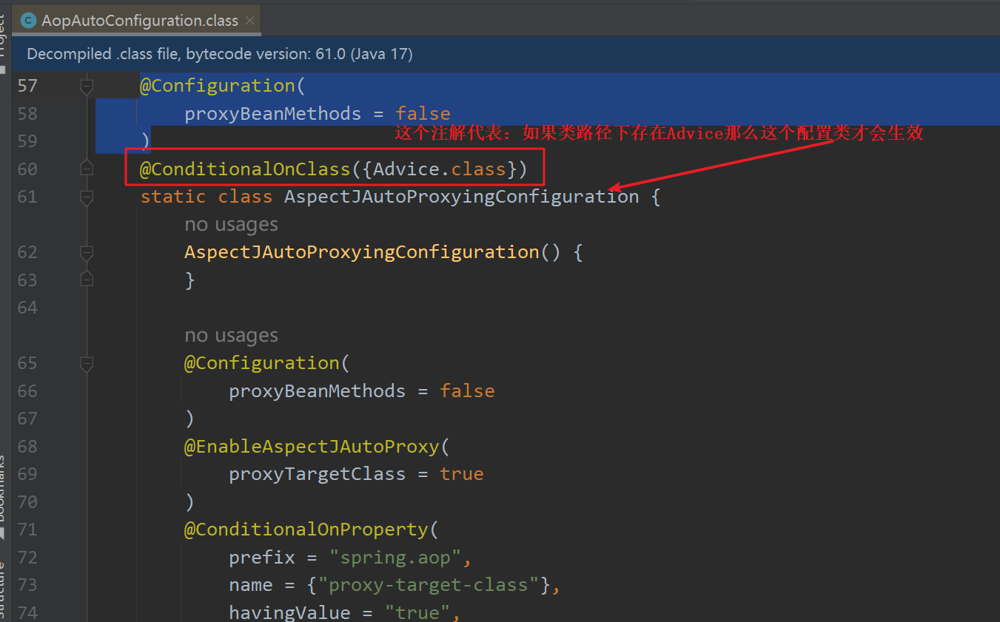

按住ctrl按键点击Advice发现报错：cannot find declaration to go to ,点不进去

Advice不存在，那么这个配置不生效的。这个类属于AOP场景下的包，所以只有你真正导入了aop场景的包才会生效。

**所以：这142个自动配置类，会按需生效。**通过条件注解@ConditionalOnXXXXXX来完成。


又比如：web依赖相关的自动配置类：DispatcherServletAutoConfiguration，


按住ctrl按键点击点击DispatcherServlet，发现可以进去，因为我们项目中导入了webmvc的包，所以底层可以使用到。

类路径下存在DispatcherServlet，那么这个配置类就生效，结合@Bean注解给容器中放入一堆组件，那这些组件就能工作。


又比如：tomcat的自动配置类：嵌入式web服务器工厂类：EmbeddedWebServerFactoryCustomizerAutoConfiguration


只要你导包有tomcat的场景，就有Tomcat这个类，只要有这个类，就会给容器放入一个tomcat服务器的工厂定制化器TomcatWebServerFactoryCustomizer，这个定制化器中要用一个东西：serverProperties


这个是什么呢？可以看看开头的注解：@EnableConfigurationProperties({ServerProperties.class})


很多自动配置类都有这个@EnableConfigurationProperties注解，这个注解代表：开启这个类和配置文件的绑定，也就是配置文件中的所有属性都封装到ServerProperties类中了，点击ServerProperties类可以看到：

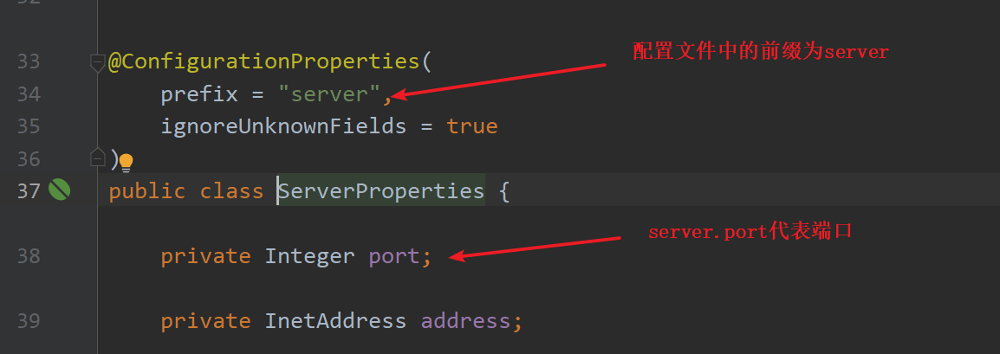

这样就可以把配置文件中server.port的属性值封装到ServerProperties这个属性类中，

@EnableConfigurationProperties注解除了开启这个类和配置文件的绑定外，还会把这个ServerProperties对象放入容器中。


再看一个与服务器有关的自动配置类：ServletWebServerFactoryAutoConfiguration

发现：也有@EnableConfigurationProperties({ServerProperties.class})这个配置：


再看下面方法：

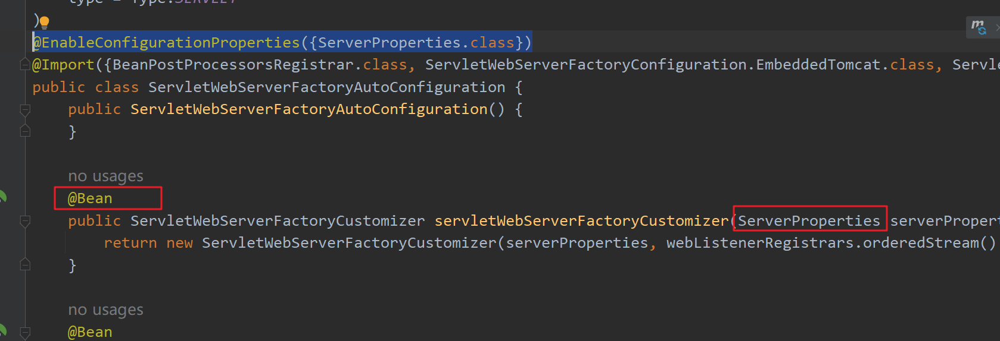

所以@Bean放入ServletWebServerFactoryCustomizer组件的时候，会要求传入ServerProperties，这个参数容器中有，会从容器中取。这样ServletWebServerFactoryCustomizer就会拥有serverProperties对象，点入ServletWebServerFactoryCustomizer：


这样底层调用这个属性就可以获取到tomcat的端口号了，可以调用各种封装的信息了，都是来源于ServerProperties封装的文件。

**所以给容器中放入的组件的核心参数，其实都是来源于XXXXProperties，XXXXProperties适合配置文件绑定的！**

只需要该配置文件中的值，这样核心组件的底层参数都能修改了！

**（三）写业务，全程无需关心各种整合。（无需我们关心，因为底层帮我们完成了整合）**


